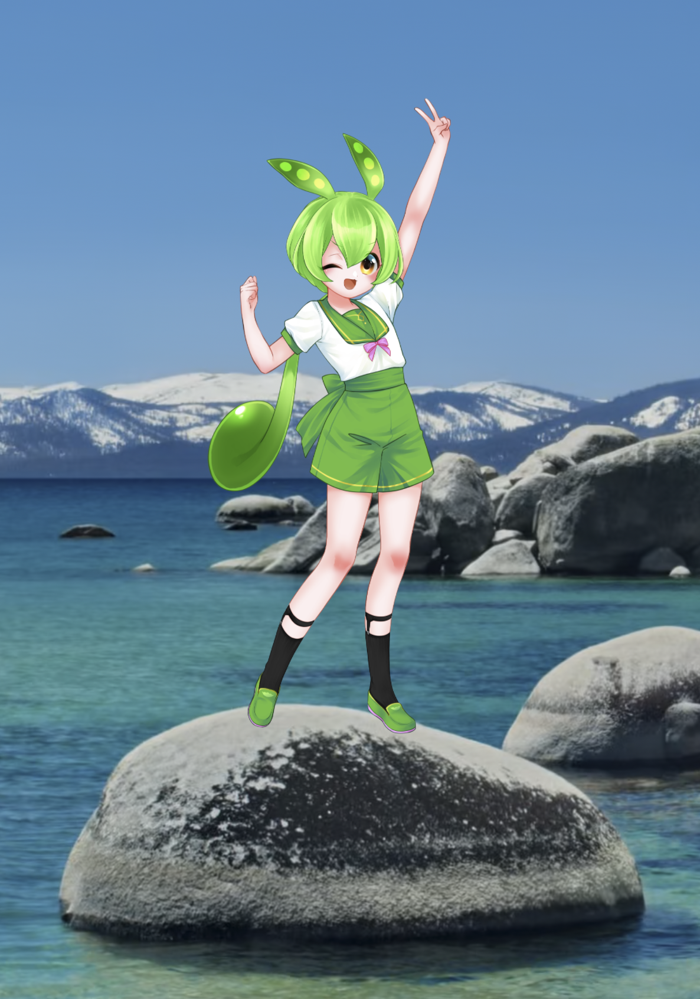
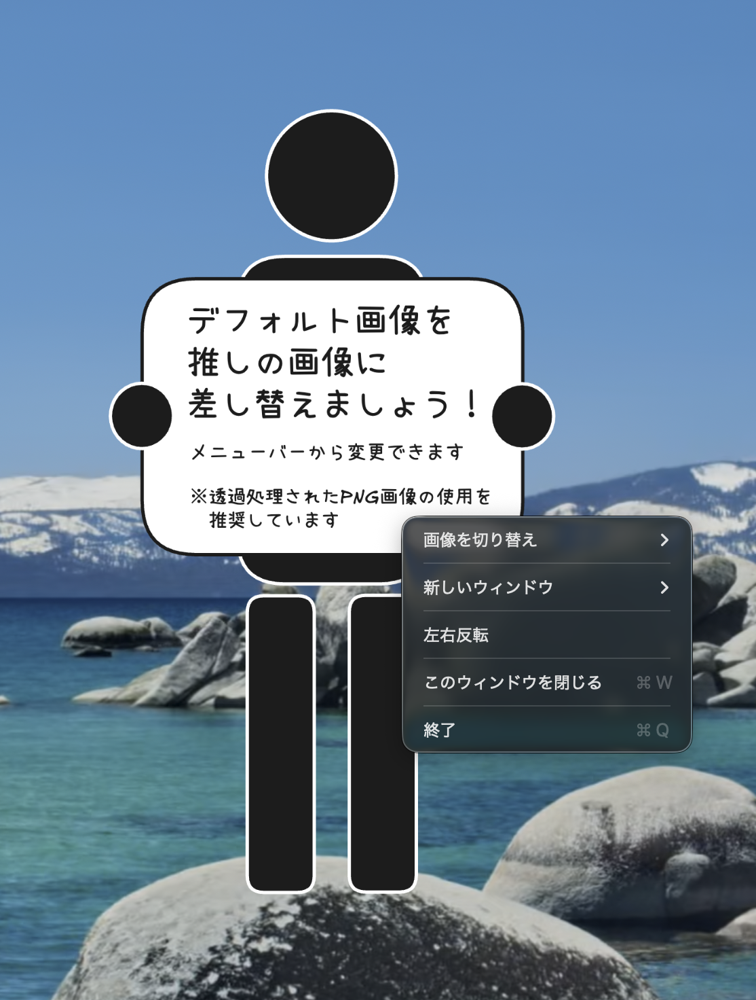
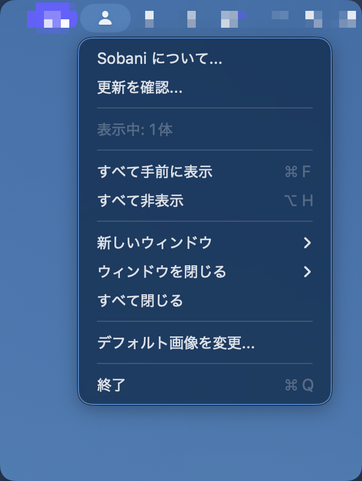

# Sobani（そばに）

> 推しを、そばに。— デスクトップアクスタアプリ

**[公式サイト](https://shiroemons.github.io/sobani/)** | [GitHub](https://github.com/shiroemons/sobani)

お気に入りのキャラクター画像を、アクリルスタンドのようにデスクトップへ常駐表示する macOS アプリケーションです。アニメーション・音声・AI 会話といった機能は持たず、「好きな画像を飾る」ことだけに特化したシンプルな設計です。画像の切り替え・スクロールリサイズ・複数ウィンドウの同時表示・ドラッグ移動・一括操作など、画像表示まわりの操作性は充実しています。

## スクリーンショット

<p align="center">
  
  
  
</p>

## 機能

- **フローティングウィンドウ** - 透明な背景でキャラクターをデスクトップ上に表示
- **常に最前面** - 他のウィンドウの上に常に表示
- **全スペース対応** - すべての仮想デスクトップで表示
- **複数ウィンドウ** - 同時に複数のキャラクターを表示可能
- **重ね順の管理** - ウィンドウの重なり順（レイヤー順）を個別に変更可能
- **ウィンドウ識別** - 各ウィンドウに永続的な連番ID（#N）を付与
- **ドラッグ移動** - クリック＆ドラッグでウィンドウを自由に移動
- **スクロールリサイズ** - マウスホイールでキャラクターのサイズを変更
- **一括操作** - Option キーを押しながら操作で全ウィンドウを同時に移動・リサイズ
- **右クリックメニュー** - コンテキストメニューから画像の切り替えや操作が可能
- **メニューバー管理** - ステータスバーからウィンドウの管理
- **画像の登録・管理** - 好きな画像を登録して切り替え
- **デフォルト画像のカスタマイズ** - 起動時のデフォルト画像を変更可能
- **画像差し替え時のサイズ維持** - 画像切り替え時にウィンドウの高さを維持し、幅はアスペクト比に合わせて自動調整
- **簡易背景除去** - JPEG・HEIC・GIF・TIFFなどの写真から被写体を自動で切り抜き（macOS 14以降、Visionフレームワーク使用）
- **自動アップデート** - GitHub Releases 経由で新バージョンを確認・ダウンロード・インストール
- **表示の調整** - 左右反転・回転（0〜360度、ダイアルUI）・透明度（10%〜100%、スライダーUI）をウィンドウごとに設定。「表示をリセット」で反転・回転・透明度を一括リセット可能
- **表示/非表示の切り替え** - Option + H ですべてのウィンドウを一括で表示・非表示
- **ログイン時に起動** - ログイン時の自動起動をメニューバーから切り替え可能（SMAppService 使用）
- **言語切り替え** — メニューバーから日本語 / English / システム言語を切り替え可能
- **ウィンドウ状態の保持** - ウィンドウの位置・サイズ・画像・反転状態・回転角度・透明度を終了時に保存し、次回起動時に復元
- **ウィンドウ位置の自動復元** - モニター切断・スリープ/復帰時にウィンドウを自動的に適切な位置へ復元

## インストール

### Homebrew（推奨）

```sh
brew install --cask shiroemons/tap/sobani
```

### 更新

```sh
brew upgrade --cask sobani
```

### 手動インストール

[Releases](https://github.com/shiroemons/sobani/releases) ページから最新の ZIP をダウンロードし、展開した `Sobani.app` を `/Applications` に移動してください。

> **初回起動時の注意**: macOS の Gatekeeper により「"Sobani"は、開発元が未確認のため開けません」と表示される場合があります。その場合は `Sobani.app` を右クリック（または Control+クリック）→「開く」を選択してください。確認ダイアログで「開く」をクリックすれば起動できます。この操作は初回のみ必要です。Homebrew でインストールした場合はこの問題は発生しません。

## 必要環境

- macOS 13.0（Ventura）以降
- Xcode 15.0 以降（ビルドする場合）

## ビルド方法

```sh
./build.sh
```

ビルドが完了すると、プロジェクトルートに `Sobani.app` が生成されます。ダブルクリックで起動できます。

> ビルドスクリプトは Release 構成でビルドし、アプリアイコンの埋め込みと日本語ローカライゼーションの設定を自動で行います。

#### 環境変数オプション

| 変数 | 説明 |
|------|------|
| `SOBANI_ARCHS` | ビルドアーキテクチャを指定（例: `"arm64 x86_64"` でユニバーサルバイナリ） |
| `SKIP_CODESIGN=1` | コード署名をスキップ |
| `NOTARIZE=1` | Apple 公証を有効化 |
| `CREATE_DMG=1` | DMG ファイルを作成 |

## スマホの写真、そのまま使えます

Sobaniは PNG だけでなく、**JPEG / GIF / TIFF / HEIC** にも対応しています。スマートフォンで撮った写真もそのまま飾れます。特別な画像加工は必要ありません。

- スマホ写真（JPEG/HEIC）→ そのままデスクトップに表示
- 背景を消したい場合 → 右クリック →「背景を除去」でワンクリック切り抜き（macOS 14以降）
- 透過PNGを用意できる場合 → 背景なしのアクスタ風表示に

> 対応する画像形式の詳細は[「対応画像形式」](#対応画像形式)をご確認ください。

## 使い方

### はじめて起動する

1. `Sobani.app` をダブルクリックで起動します
2. デフォルトのプレースホルダー画像が画面中央に表示されます（前回終了時のウィンドウ状態が保存されている場合は、その位置・サイズ・画像で復元されます）
3. メニューバーにアイコン（👤）が表示されます
4. ウィンドウは常に最前面に表示され、すべての仮想デスクトップで表示されます

### 基本的な操作

**ウィンドウを移動する**

- ドラッグで移動できます
- Option キーを押しながらドラッグすると、すべてのウィンドウを一括移動できます

**サイズを変更する**

- スクロール（マウスホイール）でリサイズできます（100px〜6000px）
- Option キーを押しながらスクロールすると、すべてのウィンドウを一括リサイズできます
- 初期表示時の高さは 600px です

**表示を調整する**

- 右クリック →「表示の調整」→「左右反転」で、そのウィンドウの画像を左右反転できます（もう一度選択すると元に戻ります）
- 右クリック →「表示の調整」→「表示の調整...」で、回転と透明度の調整パネルを開きます
  - 回転: ダイアルUIまたは数値入力で0〜360度の回転が可能（5度スナップ）
  - 透明度: スライダーで10%〜100%の透明度を調整
- 右クリック →「表示の調整」→「回転をリセット」「透明度をリセット」で個別にリセットできます
- 右クリック →「表示の調整」→「表示をリセット」で反転・回転・透明度をまとめて初期状態に戻せます
- 各設定はウィンドウごとに独立して管理されます

**すべてのウィンドウを表示/非表示にする**

- Option + H ですべてのウィンドウの表示/非表示を一括で切り替えられます
- メニューバーからも「すべて非表示」/「すべて表示」で操作できます
- このショートカットはアプリがアクティブでなくても使用できるグローバルホットキーです

### 画像を管理する

**表示画像を変更する**

右クリック →「表示画像の変更」から操作します。

- 「デフォルト画像に戻す」（`d`）— デフォルト画像に戻します
- 「画像を変更...」（`o`）— ファイル選択ダイアログから画像を選択します
- 登録済みの画像がある場合、「登録画像」の一覧から選択できます

**新しい画像を登録する**

1. 右クリック →「表示画像の変更」→「画像を変更...」（`o`）を選択
2. ファイル選択ダイアログから画像を選択
3. 選択した画像は自動的に登録され、ウィンドウに表示されます

画像は `~/Library/Application Support/Sobani/images/` に保存されます。同じファイル名の画像がすでに登録されている場合、`_1`、`_2` のように連番が付与されます。対応する画像形式は[「対応画像形式」](#対応画像形式)をご確認ください。

**登録済みの画像を削除する**

右クリック →「登録画像を削除」→ 削除する画像を選択します。

**デフォルト画像をカスタマイズする**

メニューバーのアイコンをクリック →「デフォルト画像を変更...」から設定できます。

- 選択した画像がデフォルト画像として設定され、デフォルト画像を表示中のすべてのウィンドウに即時反映されます
- `~/Library/Application Support/Sobani/default.png` として保存されます
- 元に戻すには「デフォルト画像をリセット」を選択します（カスタム設定時のみ表示）

### 複数のウィンドウを扱う

**画像を追加表示する**

以下のいずれかの方法で追加できます。

- 右クリック →「画像を追加表示」→ デフォルト画像・登録画像・「画像を選択...」から選択
- メニューバーのアイコン →「画像を追加表示」→ デフォルト画像・登録画像・「画像を選択...」から選択
- キーボードショートカット `n` でデフォルト画像のウィンドウを追加

「画像を選択...」を使うと、ファイル選択ダイアログから新しい画像を選んで直接ウィンドウを開けます。選択した画像は自動的に登録されます。

**全ウィンドウを一括操作する**

Option キーを押しながら操作すると、すべてのウィンドウに対して一括で操作できます。

- Option + ドラッグ — すべてのウィンドウを一括移動
- Option + スクロール — すべてのウィンドウを一括リサイズ
- Option + H — すべてのウィンドウを一括で表示/非表示

**画像を閉じる**

- キーボードショートカット `w` またはコンテキストメニューの「この画像を閉じる」で個別に閉じます
- メニューバーの「表示中: X体」サブメニューから個別に閉じます
- メニューバーの「すべて閉じる」ですべてのウィンドウを閉じます
- すべてのウィンドウを閉じると、アプリケーションは自動的に終了します

**ウィンドウ状態の保持**

アプリ終了時に、すべてのウィンドウの状態が自動的に保存されます。次回起動時に前回の状態が復元されます。

保存される情報:

- ウィンドウの位置とサイズ
- 表示している画像
- 左右反転の状態
- 回転角度
- 透明度
- ウィンドウID（#N）
- ウィンドウの重なり順

> 保存された画像ファイルが見つからない場合は、デフォルト画像で復元されます。ウィンドウが画面外にある場合は、画面内に自動的に調整されます。保存先は[「データ保存先」](#データ保存先)を参照してください。

### メニューバーから管理する

メニューバーのアイコンをクリックすると、以下の操作ができます。

| メニュー項目 | 説明 |
|------|------|
| Sobani について... | バージョン情報を表示 |
| 更新を確認... / 更新する（vX.X） | アップデートの確認・実行 |
| ログイン時に起動 | チェックでログイン時の自動起動を切り替え |
| 表示中: X体 / 非表示中: X体 | サブメニューでZ-order順の画像一覧を表示。各項目に表示サイズ（例: `[600×402]`）と画面名を表示（重ね順変更・反転・調整・表示をリセット・個別閉じるが可能）。非表示のウィンドウがある場合は非表示数も表示 |
| すべて手前に表示（`f`） | すべてのウィンドウを最前面に表示 |
| すべて非表示 / すべて表示（`Option+H`） | すべてのウィンドウの表示/非表示を一括切り替え |
| すべての画像の回転をリセット | すべてのウィンドウの回転を0度にリセット |
| すべての画像の透明度をリセット | すべてのウィンドウの透明度を100%にリセット |
| 画像を追加表示 | デフォルト画像・登録画像・画像選択でウィンドウを追加 |
| すべて閉じる | すべてのウィンドウを閉じる |
| デフォルト画像を変更... | デフォルト画像をカスタマイズ |
| デフォルト画像をリセット | カスタムデフォルト画像を元に戻す（設定時のみ表示） |
| 言語 | サブメニューで日本語 / English / システムを選択 |
| 終了（`q`） | アプリケーションを終了 |

### アプリを終了する

以下のいずれかの方法で終了できます。

- キーボードショートカット `q`
- メニューバーのアイコン →「終了」
- 右クリックメニュー →「終了」
- すべてのウィンドウを閉じると自動的に終了します

### アップデート

アプリは GitHub Releases から自動的に最新バージョンを確認します。

- **起動時**: 毎回アップデートを確認
- **定期チェック**: 24時間ごとにバックグラウンドで確認
- **スリープ復帰時**: 前回チェックから24時間以上経過していれば確認
- **手動確認**: メニューバー →「更新を確認...」

新しいバージョンが見つかると、メニュー表示が「更新する（vX.X）」に変わります。クリックすると確認ダイアログの後、ダウンロード・置き換え・再起動が自動で行われます。

## 操作方法

> 各操作の詳しい使い方は[「使い方」](#使い方)を参照してください。

### マウス操作

| 操作 | 動作 |
|------|------|
| ドラッグ | ウィンドウを移動 |
| Option + ドラッグ | すべてのウィンドウを一括移動 |
| スクロール | ウィンドウをリサイズ |
| Option + スクロール | すべてのウィンドウを一括リサイズ |
| 右クリック | コンテキストメニューを表示 |

### 右クリックメニュー

| メニュー項目 | 説明 |
|------|------|
| 表示画像の変更 | 画像の変更・登録画像からの選択 |
| 画像を追加表示 | デフォルト画像・登録画像・画像選択でウィンドウを追加 |
| 登録画像を削除 | 登録済みの画像を削除 |
| 表示の調整 | 左右反転、表示の調整パネル、回転リセット、透明度リセット、表示をリセット（反転・回転・透明度の一括リセット） |
| この画像を閉じる（`w`） | この画像を閉じる |
| 終了（`q`） | アプリケーションを終了 |

### キーボードショートカット

| キー | 動作 |
|------|------|
| `d` | デフォルト画像に戻す |
| `o` | 画像を変更（ファイル選択ダイアログ） |
| `n` | 新しいウィンドウを開く |
| `w` | このウィンドウを閉じる |
| `f` | すべてのウィンドウを手前に表示 |
| `Option+H` | すべてのウィンドウを表示/非表示 |
| `q` | アプリケーションを終了 |

## 対応画像形式

以下の画像形式をサポートしています。

- PNG（推奨）
- JPEG / JPG
- GIF
- TIFF
- HEIC

> 透明な背景でキャラクターを表示するため、**透過処理された PNG 画像の使用を推奨**します。JPEG など透過に対応していない形式や、背景が透過されていない画像は、矩形の背景がそのまま表示されます。

## データ保存先

アプリケーションのデータは以下のディレクトリに保存されます。

```
~/Library/Application Support/Sobani/
├── images/                       # 登録した画像ファイル
├── default.png                   # カスタムデフォルト画像（設定時のみ）
├── window_states.json            # ウィンドウ状態の保存ファイル（自動生成）
└── pending_restorations.json     # 画面復元待ちキュー（自動生成・一時的）
```

## バージョニング

バージョン番号は `vYYYYMM.N` 形式を採用しています。

- `YYYY` — 西暦4桁
- `MM` — 月2桁（ゼロ埋め）
- `N` — 月内の連番（0始まり）

月が変わると `N` は `0` にリセットされます。

例: `v202602.0` → 2026年2月の最初のリリース

## 開発ツール

### SwiftLint

コードスタイルの一貫性を保つために [SwiftLint](https://github.com/realm/SwiftLint) を使用しています。

```sh
brew install swiftlint
```

ビルドスクリプト（`./build.sh`）実行時に自動でリントチェックが行われます。Xcode でのビルド時にも Build Phase として実行されます。SwiftLint が未インストールの場合は警告を表示し、ビルドは続行します。

## トラブルシューティング

### ウィンドウ位置の復元ログを確認する

スリープ復帰やモニター切断時のウィンドウ位置復元に問題がある場合、`os_log` のログで動作を確認できます。

通常時はエラーレベルのログのみ出力されます。詳細なデバッグログを確認するには `--level debug` を指定してください。

**リアルタイムで監視する（詳細ログ含む）:**

```sh
log stream --predicate 'subsystem == "com.shiroemons.Sobani"' --level debug --style compact
```

**直近のログを確認する（詳細ログ含む）:**

```sh
log show --predicate 'subsystem == "com.shiroemons.Sobani"' --level debug --last 5m --style compact
```

ログには以下の情報が記録されます:

| イベント | レベル | ログ例 |
|---------|--------|--------|
| オブザーバ登録 | debug | `[ScreenRestoration] observers registered, screens=3` |
| スクリーン変更検出 | debug | `screenChange: isWake=true, screens=3` |
| スリープ前の状態保存 | info | `[ScreenRestoration] willSleep: saved 3 windows` |
| ウェイク復元開始 | info | `[ScreenRestoration] didWake: 3 windows to restore` |
| ウィンドウ復元結果 | debug | `restore #4: saved={x, y} -> {x, y} -> {x, y}` |
| 復元試行状況 | debug | `attempt #1: restoredAll=true, screens=[...]` |
| モニター未検出 | error | `restore #1: screen not found (displayID=2)` |

> ウィンドウ復元結果の3つの座標は、左から順に「保存時の座標」→「計算後の座標」→「クランプ後の座標」を表します。正常時は3つが一致します。

### アップデートエラーコード

自動アップデートが失敗した場合、ダイアログにエラーコードが表示されます。問題の報告時にこのコードを添えていただくと原因の特定に役立ちます。

| コード | フェーズ | 説明 |
|--------|----------|------|
| U-101 | チェック | API通信のネットワークエラー |
| U-102 | チェック | APIからデータ未受信 |
| U-103 | チェック | JSONパース失敗 |
| U-201 | ダウンロード | ダウンロード中のネットワークエラー |
| U-202 | ダウンロード | 一時ファイルが見つからない |
| U-203 | ダウンロード | SHA256チェックサム不一致 |
| U-301 | インストール (ZIP) | ZIP展開失敗 |
| U-302 | インストール (ZIP) | ZIP内に.appが見つからない |
| U-303 | インストール (ZIP) | インストール準備中の例外 |
| U-401 | インストール (DMG) | DMGマウント失敗 |
| U-402 | インストール (DMG) | DMG内に.appが見つからない |
| U-403 | インストール (DMG) | インストール準備中の例外 |
| U-501 | 置換・再起動 | 現在のアプリパス取得失敗 |
| U-502 | 置換・再起動 | アプリバックアップ失敗 |
| U-503 | 置換・再起動 | アプリ置換失敗 |

## ドキュメント

詳細なガイドを `docs/guide/` に用意しています。

### ユーザー向け

- [操作ガイド](docs/guide/usage.md) — メニュー構造、画像管理、調整パネルの使い方
- [アップデートと画面復元](docs/guide/update-and-restore.md) — 自動アップデートの仕組みとモニター復元

### 開発者向け

- [アーキテクチャ](docs/guide/architecture.md) — コンポーネント関係、ライフサイクル、ウィンドウ構造
- [データフロー](docs/guide/data-flow.md) — ウィンドウ状態の保存・復元、画像管理のデータの流れ

## SNSで共有

Sobaniを使っている様子をぜひSNSでシェアしてください！

- **#SobaniApp** — アプリの感想やスクリーンショットに
- **#デスクトップアクスタ** — あなたのデスクトップを見せてください

## ライセンス

本プロジェクトのソースコードは [MIT License](LICENSE) のもとで公開されています。
