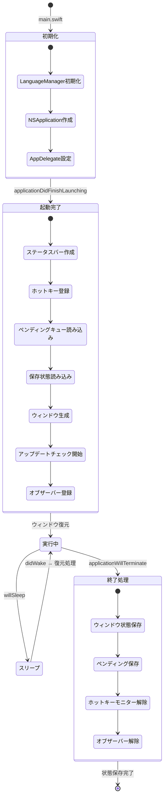
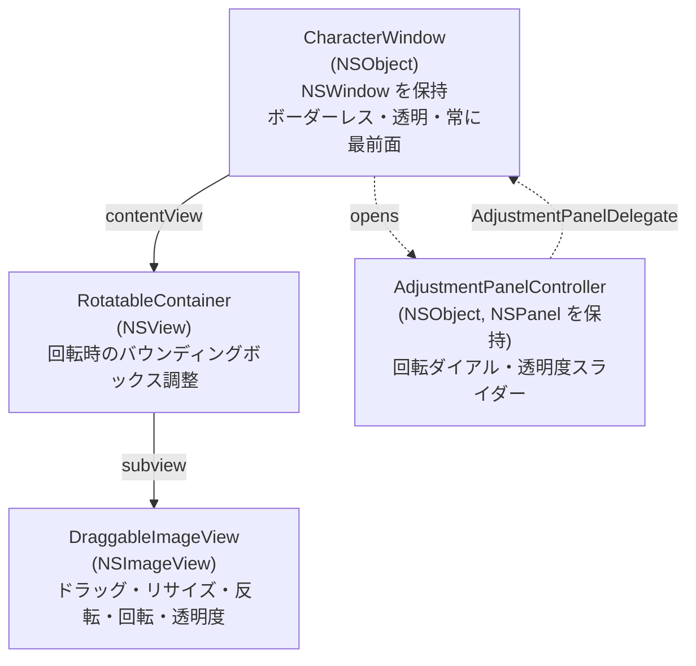

# アーキテクチャ

Sobani の内部構造を解説します。

[← 目次](README.md)

## 技術スタック

- Swift 5.0 / Cocoa (AppKit)
- macOS 13.0+
- 外部依存なし
- LSUIElement（ドックアイコンなし）

## コンポーネント関係図

```mermaid
classDiagram
    class AppDelegate {
        +characterWindows: [CharacterWindow]
        +zOrderedWindows: [CharacterWindow]
        +statusItem: NSStatusItem
        +screenRestorationManager: ScreenRestorationManager
        +wakeContext: WakeRestorationContext
        +setupStatusBar()
        +createNewWindow()
    }
    class CharacterWindow {
        +window: NSWindow
        +imageView: DraggableImageView
        +windowId: Int
        +delegate: CharacterWindowDelegate
    }
    class DraggableImageView {
        +isFlippedHorizontally: Bool
        +rotationAngle: CGFloat
        +opacityLevel: CGFloat
    }
    class AdjustmentPanelController {
        +delegate: AdjustmentPanelDelegate
    }
    class ImageManager {
        +shared: ImageManager
        +registerImage()
        +loadRegisteredImage()
        +removeRegisteredImage()
    }
    class WindowStateManager {
        +shared: WindowStateManager
        +saveStates()
        +loadStates()
    }
    class UpdateManager {
        +shared: UpdateManager
        +checkForUpdate()
    }
    class ScreenRestorationManager {
        +addPending()
        +restorableEntries()
    }
    class LanguageManager {
        +shared: LanguageManager
        +currentLanguage: Language
    }
    class LaunchAtLoginManager {
        +shared: LaunchAtLoginManager
        +isEnabled: Bool
        +toggle()
        +status: SMAppServiceStatus
    }
    class LayoutPresetManager {
        +shared: LayoutPresetManager
        +savePreset()
        +loadPreset()
        +deletePreset()
    }
    class UnconstrainedWindow {
        +constrainFrameRect()
    }

    AppDelegate --> CharacterWindow : manages
    AppDelegate ..|> CharacterWindowDelegate
    AppDelegate ..|> UpdateManagerDelegate
    AppDelegate ..|> NSMenuDelegate
    CharacterWindow --> DraggableImageView : contains
    CharacterWindow --> AdjustmentPanelController : opens
    CharacterWindow ..|> AdjustmentPanelDelegate
    CharacterWindow ..|> NSMenuDelegate
    AppDelegate --> ImageManager : uses
    AppDelegate --> WindowStateManager : uses
    AppDelegate --> UpdateManager : uses
    AppDelegate --> ScreenRestorationManager : owns
    AppDelegate --> LanguageManager : uses
    AppDelegate --> LaunchAtLoginManager : uses
    AppDelegate --> LayoutPresetManager : uses
    CharacterWindow --> UnconstrainedWindow : uses
```

`AppDelegate` がアプリケーション全体を統括し、複数の `CharacterWindow` を管理します。各ウィンドウは `DraggableImageView` を内包し、調整パネルを通じて回転・透明度の操作を受け付けます。シングルトンとして提供される各マネージャーは `AppDelegate` が利用し、それぞれの責務（画像管理・状態保存・アップデート・言語切り替え）を担います。

## ソースファイル一覧

| ファイル | 説明 |
|---|---|
| `main.swift` | エントリポイント。`LanguageManager` を UI ロード前に初期化 |
| `AppDelegate.swift` | アプリケーション全体の管理。ウィンドウライフサイクル、Z-order、ホットキー |
| `AppDelegate+StatusBarMenu.swift` | ステータスバーメニューの構築 |
| `AppDelegate+ScreenRestoration.swift` | モニター切断・スリープ/復帰時のウィンドウ位置復元 |
| `CharacterWindow.swift` | ボーダーレス透明ウィンドウ。`RotatableContainer`、コンテキストメニュー |
| `DraggableImageView.swift` | ドラッグ移動、スクロールリサイズ、反転/回転/透明度 |
| `AdjustmentPanelController.swift` | 回転ダイアル・透明度スライダーのパネル |
| `ImageManager.swift` | 画像の登録・読み込み・削除（シングルトン） |
| `WindowStateManager.swift` | ウィンドウ状態の永続化（シングルトン） |
| `UpdateManager.swift` | GitHub Releases 経由の自動アップデート（シングルトン） |
| `LaunchAtLoginManager.swift` | ログイン時自動起動の管理（`SMAppService`、シングルトン） |
| `ScreenRestorationManager.swift` | 復元待ちキューの管理（シングルトンではなく `AppDelegate` が所有）。`PendingRestoration` 構造体も同ファイルに定義 |
| `LanguageManager.swift` | ランタイム言語切り替え（シングルトン） |
| `Constants.swift` | `AppConstants`、`GeometryUtils`、`MenuItemTag`、`L()` ヘルパー |
| `LayoutPresetManager.swift` | レイアウトプリセットの保存・読み込み・削除を管理するシングルトン。`layouts/` ディレクトリにプリセットごとのJSONファイルを保存 |
| `UnconstrainedWindow.swift` | `NSWindow` サブクラス。`constrainFrameRect` をオーバーライドし画面端制約を無効化。透過PNG画像のメニューバー越え配置を実現 |
| `DragDropUtils.swift` | ドラッグ＆ドロップ操作のユーティリティ。ペーストボードから対応画像URLを抽出 |
| `WakeRestorationContext.swift` | スリープ/復帰時の復元コンテキスト |

## シングルトン一覧

| シングルトン | 責務 |
|---|---|
| `ImageManager.shared` | ユーザー登録画像の管理（`~/Library/Application Support/Sobani/images/`） |
| `WindowStateManager.shared` | ウィンドウ状態の保存・読み込み（`window_states.json`） |
| `UpdateManager.shared` | GitHub Releases を利用した自動アップデートの確認・適用 |
| `LaunchAtLoginManager.shared` | `SMAppService` を通じたログイン時自動起動の切り替え |
| `LanguageManager.shared` | 日本語・英語・システム言語のランタイム切り替え |
| `LayoutPresetManager.shared` | レイアウトプリセットの保存・読み込み・削除（`layouts/` ディレクトリ） |

`ScreenRestorationManager` はシングルトンではなく、`AppDelegate` が所有するインスタンスです。

## プロトコル

### CharacterWindowDelegate

`CharacterWindow` と `AppDelegate` 間の通信を担うプロトコルです。`AppDelegate` が準拠します。

| メソッド | 用途 |
|---|---|
| `characterWindowRequestedNewWindow(_:imageName:)` | 新しいキャラクターウィンドウの生成を要求 |
| `characterWindowRequestedNewWindowWithFileURL(_:fileURL:)` | ファイル URL を指定した新しいウィンドウの生成を要求 |
| `characterWindowDidClose(_:)` | ウィンドウが閉じられたことを通知 |
| `characterWindowDidDeleteImage(named:)` | 画像が削除されたことを通知 |
| `characterWindowDidBecomeActive(_:)` | ウィンドウがアクティブになったことを通知（Z-order 管理） |

### AdjustmentPanelDelegate

`AdjustmentPanelController` と `CharacterWindow` 間の通信を担うプロトコルです。`CharacterWindow` が準拠します。

| メソッド | 用途 |
|---|---|
| `rotationPanel(_:didChangeAngle:)` | 回転ダイアルの角度変更を通知 |
| `rotationPanelDidReset(_:)` | 回転のリセットを通知 |
| `adjustmentPanel(_:didChangeOpacity:)` | 透明度スライダーの変更を通知 |
| `adjustmentPanelDidResetOpacity(_:)` | 透明度のリセットを通知 |

### UpdateManagerDelegate

`UpdateManager` から `AppDelegate` へアップデート状態の変化を通知します。

| メソッド | 用途 |
|---|---|
| `updateManager(_:didChangeState:)` | アップデート状態の変化を通知 |

## アプリのライフサイクル

起動時は `main.swift` で `LanguageManager` を初期化してから `NSApplication` を生成します。`applicationDidFinishLaunching` でステータスバー・ホットキーを設定し、`WindowStateManager` から前回の状態を読み込んでウィンドウを復元します。スリープ/復帰イベントは `AppDelegate+ScreenRestoration.swift` が処理し、モニター構成の変化に対応した三段階の復元を行います。終了時は全ウィンドウの状態を `window_states.json` に保存します。

## ウィンドウの構造

`CharacterWindow` は `NSObject` のサブクラスで、`NSWindow` インスタンスをプロパティとして保持します。ウィンドウはボーダーレスかつ透明で、全 Space に表示される常に最前面のウィンドウです。`contentView` として `RotatableContainer` を設定し、その子ビューとして `DraggableImageView` が配置されます。

`RotatableContainer` は `CharacterWindow.swift` 内に定義された `private class` であり、外部からは参照できません。`CharacterWindow` のプロパティとしては保持されず、`init` 内でローカル変数として生成され `window.contentView` に設定されます。回転を適用した際に画像の領域が元の寸法を超えて拡大するため、バウンディングボックスを正しく計算・調整する役割を担います。`DraggableImageView` はマウスドラッグによる移動、スクロールホイールによるリサイズ、そして反転・回転・透明度の状態を保持します。

`AdjustmentPanelController` は別の `NSPanel` として表示されるフローティングパネルで、`AdjustmentPanelDelegate` を通じて `CharacterWindow` に変更を伝えます。

[← 目次](README.md)
