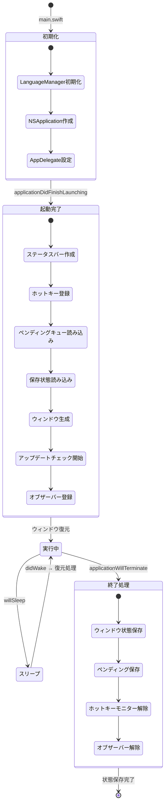
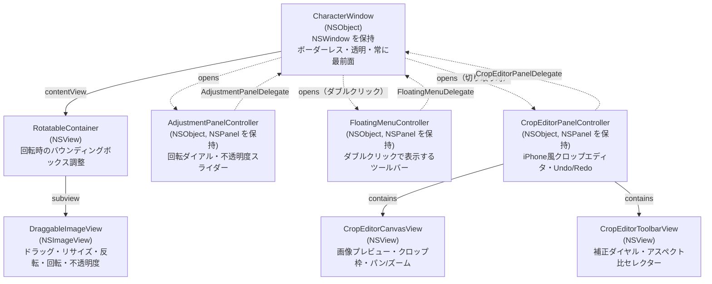

# アーキテクチャ

Sobani の内部構造を解説します。

[← 目次](README.md)

## 技術スタック

- Swift 6 / Cocoa (AppKit)
- macOS 14.0+
- 外部依存なし
- LSUIElement（ドックアイコンなし）

## コンポーネント関係図

```mermaid
classDiagram
    class AppDelegate {
        +characterWindows: [CharacterWindow]
        +zOrderedWindows: [CharacterWindow]
        +statusItem: NSStatusItem
        +screenRestorationManager: ScreenRestorationManager
        +wakeContext: WakeRestorationContext
        +setupStatusBar()
        +createNewWindow()
    }
    class CharacterWindow {
        +window: NSWindow
        +imageView: DraggableImageView
        +windowId: Int
        +delegate: CharacterWindowDelegate
    }
    class DraggableImageView {
        +isFlippedHorizontally: Bool
        +rotationAngle: CGFloat
        +opacityLevel: CGFloat
    }
    class AdjustmentPanelController {
        +delegate: AdjustmentPanelDelegate
    }
    class ImageManager {
        +shared: ImageManager
        +registerImage()
        +loadRegisteredImage()
        +removeRegisteredImage()
    }
    class WindowStateManager {
        +shared: WindowStateManager
        +saveStates()
        +loadStates()
    }
    class UpdateManager {
        +shared: UpdateManager
        +checkForUpdate()
    }
    class ScreenRestorationManager {
        +addPending()
        +restorableEntries()
    }
    class LanguageManager {
        +shared: LanguageManager
        +currentLanguage: Language
    }
    class LaunchAtLoginManager {
        +shared: LaunchAtLoginManager
        +isEnabled: Bool
        +toggle()
        +status: SMAppServiceStatus
    }
    class LayoutPresetManager {
        +shared: LayoutPresetManager
        +savePreset()
        +loadPreset()
        +deletePreset()
    }
    class UnconstrainedWindow {
        +constrainFrameRect()
    }
    class FloatingMenuController {
        +delegate: FloatingMenuDelegate
        +show(near:)
        +dismiss()
    }
    class CropEditorPanelController {
        +delegate: CropEditorPanelDelegate
        +currentCropRect: CropRect
        +history: CropEditHistory
        +show(image:near:)
        +dismiss()
    }
    class CropEditorCanvasView {
        +cropRect: CropRect
        +image: NSImage
    }
    class CropEditorToolbarView {
        +straightenMode: StraightenMode
        +toolbarMode: ToolbarMode
    }
    class CropEditHistory {
        +record(state:)
        +undo()
        +redo()
    }
    class CropRect {
        +x: CGFloat
        +y: CGFloat
        +width: CGFloat
        +height: CGFloat
        +straightenAngle: CGFloat
        +quarterTurns: Int
        +isFlippedInCrop: Bool
        +aspectRatioPreset: String?
        +verticalPerspective: CGFloat
        +horizontalPerspective: CGFloat
    }
    class AspectRatioSelectorView {
        +selectedPreset: AspectRatioPreset
    }

    class ManagementPanelController {
        +show()
        +close()
        +toggle()
        +isVisible: Bool
    }
    class ManagementPanelViewModel {
        +selectedTab: ManagementTab?
        +selectedWindowIds: Set~Int~
        +windows: [WindowInfo]
        +registeredImageNames: [String]
        +windowCountByImageName: [String: Int]
        +triggerRefresh()
    }
    class ManagementPanelView {
    }
    class WindowManagementView {
    }
    class LayoutPresetsView {
    }
    class RegisteredImagesView {
    }
    class SettingsView {
    }

    AppDelegate --> CharacterWindow : manages
    AppDelegate ..|> CharacterWindowDelegate
    AppDelegate ..|> UpdateManagerDelegate
    AppDelegate ..|> NSMenuDelegate
    CharacterWindow --> DraggableImageView : contains
    CharacterWindow --> AdjustmentPanelController : opens
    CharacterWindow ..|> AdjustmentPanelDelegate
    CharacterWindow ..|> NSMenuDelegate
    AppDelegate --> ImageManager : uses
    AppDelegate --> WindowStateManager : uses
    AppDelegate --> UpdateManager : uses
    AppDelegate --> ScreenRestorationManager : owns
    AppDelegate --> LanguageManager : uses
    AppDelegate --> LaunchAtLoginManager : uses
    AppDelegate --> LayoutPresetManager : uses
    AppDelegate --> ManagementPanelController : owns
    ManagementPanelController --> ManagementPanelViewModel : owns
    ManagementPanelController --> ManagementPanelView : hosts
    ManagementPanelViewModel --> AppDelegate : weak ref
    ManagementPanelView --> WindowManagementView : tab
    ManagementPanelView --> LayoutPresetsView : tab
    ManagementPanelView --> RegisteredImagesView : tab
    ManagementPanelView --> SettingsView : tab
    CharacterWindow --> UnconstrainedWindow : uses
    CharacterWindow --> FloatingMenuController : uses
    CharacterWindow --> CropEditorPanelController : uses
    CharacterWindow ..|> CropEditorPanelDelegate
    CharacterWindow ..|> FloatingMenuDelegate
    CropEditorPanelController --> CropEditorCanvasView : contains
    CropEditorPanelController --> CropEditorToolbarView : contains
    CropEditorPanelController --> CropEditHistory : uses
    CropEditorToolbarView --> AspectRatioSelectorView : contains
```

`AppDelegate` がアプリケーション全体を統括し、複数の `CharacterWindow` を管理します。各ウィンドウは `DraggableImageView` を内包し、調整パネルを通じて回転・不透明度の操作を受け付けます。シングルトンとして提供される各マネージャーは `AppDelegate` が利用し、それぞれの責務（画像管理・状態保存・アップデート・言語切り替え）を担います。`ManagementPanelController` は `AppDelegate` が所有するインスタンスで、SwiftUI ベースの管理パネル（`NSPanel`）のライフサイクルを管理します。`ManagementPanelViewModel` は MVVM の ViewModel として `AppDelegate` への weak 参照を持ち、ウィンドウ一覧・登録画像・レイアウト操作を各 SwiftUI View に提供します。

## ソースファイル一覧

| ファイル | 説明 |
|---|---|
| `main.swift` | エントリポイント。`LanguageManager` を UI ロード前に初期化 |
| **ManagementPanel/** | **管理パネル（SwiftUI）** |
| `ManagementPanel/ManagementPanelController.swift` | 管理パネル（NSPanel）のライフサイクル管理。`show()` / `close()` / `toggle()` を提供 |
| `ManagementPanel/ManagementPanelViewModel.swift` | 管理パネルの ViewModel。ウィンドウ一覧・登録画像・状態をまとめて保持し、NotificationCenter 経由でリアルタイム更新 |
| `ManagementPanel/ManagementPanelViewModel+WindowInfo.swift` | `WindowInfo` 構造体の定義（ウィンドウのスナップショット情報） |
| `ManagementPanel/ManagementPanelViewModel+WindowActions.swift` | ViewModel のウィンドウ操作拡張（クロップ・反転・調整パネル・レイアウト操作など） |
| `ManagementPanel/ManagementPanelView.swift` | トップレベル SwiftUI View。NavigationSplitView でサイドバーとタブコンテンツを構成 |
| `ManagementPanel/WindowManagementView.swift` | Images タブ。ミニマップ・ウィンドウリスト・詳細パネルの3分割レイアウト |
| `ManagementPanel/WindowListView.swift` | ウィンドウ一覧リスト。Z オーダー変更・一括操作・表示/非表示・ゴーストモードトグル |
| `ManagementPanel/WindowDetailView.swift` | 選択ウィンドウの詳細パネル。不透明度スライダー・ゴーストモード設定・アクションボタン群 |
| `ManagementPanel/WindowPositionEditorView.swift` | ウィンドウ位置・サイズの直接入力エディタ |
| `ManagementPanel/LayoutPresetsView.swift` | Layouts タブ。プリセット一覧・作成・適用・リネーム・削除（Undo 対応トースト） |
| `ManagementPanel/PresetDetailView.swift` | プリセット詳細画面（読み取り専用）。選択ウィンドウの保存状態を表示 |
| `ManagementPanel/PresetMinimapView.swift` | 全スクリーン・全ウィンドウ位置を縮小表示するミニマップ View |
| `ManagementPanel/MinimapLayout.swift` | ミニマップのレイアウト計算ユーティリティ |
| `ManagementPanel/RegisteredImagesView.swift` | Registered Images タブ。画像一覧・使用中ウィンドウ数バッジ・削除確認 |
| `ManagementPanel/SettingsView.swift` | Settings タブ。一般・ゴーストモード・外観・ホットキー・アップデートの各設定 |
| `ManagementPanel/HotkeyRecorderView.swift` | ホットキー入力レコーダー View（キー押下を直接キャプチャ） |
| `ManagementPanel/CropOverlayPreviewView.swift` | CropRect を適用したプレビュー表示 View |
| `ManagementPanel/CroppedImageHelper.swift` | クロップ済み画像のキャッシュ付き生成ユーティリティ |
| `ManagementPanel/SharedViews.swift` | 管理パネル内で共有する汎用 View 部品（ThumbnailView, EmptySelectionView など） |
| `AlertFactory.swift` | アラートダイアログの生成ユーティリティ |
| `AppDelegate.swift` | アプリケーション全体の管理。ウィンドウライフサイクル、Z-order、ホットキー |
| `AppDelegate+LayoutPreset.swift` | レイアウトプリセット操作のAppDelegate拡張 |
| `AppDelegate+ScreenRestoration.swift` | モニター切断・スリープ/復帰時のウィンドウ位置復元 |
| `AppDelegate+Services.swift` | サービス初期化・管理のAppDelegate拡張 |
| `AppDelegate+StatusBarMenu.swift` | ステータスバーメニューの構築 |
| `AppDelegate+TestableLogic.swift` | テスト可能なビジネスロジックのAppDelegate拡張 |
| `AppSupportDirectory.swift` | Application Supportディレクトリ取得ユーティリティ（`AppSupportDirectory.url(baseDirectory:logger:)`） |
| `AspectRatioPreset.swift` | アスペクト比プリセットの定義（フリー・オリジナル・1:1・3:2・4:3・16:9等） |
| `AspectRatioSelectorView.swift` | アスペクト比プリセット選択UI（フリー・オリジナル・1:1・3:2・4:3・16:9等） |
| `AdjustmentPanelController.swift` | 回転ダイアル・不透明度スライダーのパネル |
| `BackgroundRemovalManager.swift` | Vision フレームワークによる背景除去（シングルトン） |
| `CharacterWindow.swift` | ボーダーレス透明ウィンドウ。`RotatableContainer`、コンテキストメニュー |
| `CharacterWindow+OtherSubmenu.swift` | 「その他」コンテキストサブメニューのCharacterWindow拡張 |
| `Constants.swift` | `AppConstants`、`GeometryUtils`、`MenuItemTag`、`L()` ヘルパー |
| `CropEditorPanelController.swift` | iPhone写真アプリ風クロップエディタのメインコントローラ。パネル管理、Undo/Redo、状態同期 |
| `CropEditorCanvasView.swift` | クロップエディタのキャンバス。画像描画、クロップ枠のハンドル操作、パン・ズーム |
| `CropEditorToolbarView.swift` | 補正モード切り替え（傾き・垂直パース・水平パース）、ルーラーダイヤル、アスペクト比セレクター |
| `CropEditHistory.swift` | クロップ編集のUndo/Redo履歴管理。線形スタック構造 |
| `CropGeometry.swift` | クロップ関連の幾何学計算ユーティリティ。座標変換、リサイズ制約、アスペクト比計算 |
| `CropImageProcessor.swift` | CropRectを実画像に適用する画像処理パイプライン（回転→反転→パース→傾き→クロップ） |
| `CropRect.swift` | クロップ状態の構造体（正規化0-1座標、回転・傾き・パース・反転・アスペクト比）。Codable対応 |
| `DragDropUtils.swift` | ドラッグ＆ドロップ操作のユーティリティ。ペーストボードから対応画像URLを抽出 |
| `DraggableImageView.swift` | ドラッグ移動、スクロールリサイズ、反転/回転/不透明度 |
| `FloatingMenuController.swift` | ダブルクリックで表示するSFシンボルアイコンのフローティングツールバー（NSPanel） |
| `ImageManager.swift` | 画像の登録・読み込み・削除（シングルトン） |
| `ImagePreviewPanel.swift` | 画像プレビューパネル |
| `JSONPersistence.swift` | JSON永続化の共通ユーティリティ（アトミック書き込み、読み込み） |
| `LaunchAtLoginManager.swift` | ログイン時自動起動の管理（`SMAppService`、シングルトン） |
| `LanguageManager.swift` | ランタイム言語切り替え（シングルトン） |
| `LayoutPresetManager.swift` | レイアウトプリセットの保存・読み込み・削除を管理するシングルトン。`layouts/` ディレクトリにプリセットごとのJSONファイルを保存 |
| `MenuStateUtils.swift` | メニュー状態管理のユーティリティ |
| `NSMenu+RegisteredImages.swift` | NSMenu拡張 — 登録画像メニュー項目の構築 |
| `NSPanel+FloatingConfig.swift` | NSPanel拡張 — フローティングパネルの共通設定 |
| `OnboardingManager.swift` | オンボーディング表示状態の管理（シングルトン） |
| `OnboardingWindowController.swift` | 初回起動時のオンボーディングガイド（3ステップ） |
| `PathSanitizer.swift` | パストラバーサル防止ユーティリティ（`safeURL(name:in:)`, `safeName(from:)`） |
| `ScreenRestorationManager.swift` | 復元待ちキューの管理（シングルトンではなく `AppDelegate` が所有）。`PendingRestoration` 構造体も同ファイルに定義 |
| `ScreenRestorationUtils.swift` | 画面復元関連のユーティリティ関数 |
| `SnapUtils.swift` | スナップ（吸着）関連のユーティリティ |
| `StraightenSliderView.swift` | iPhone風ルーラーダイヤル。慣性スクロール・フェードトレイルエフェクト対応 |
| `UnconstrainedWindow.swift` | `NSWindow` サブクラス。`constrainFrameRect` をオーバーライドし画面端制約を無効化。透過PNG画像のメニューバー越え配置を実現 |
| `UpdateManager.swift` | GitHub Releases 経由の自動アップデート（シングルトン） |
| `WakeRestorationContext.swift` | スリープ/復帰時の復元コンテキスト |
| `WindowStateManager.swift` | ウィンドウ状態の永続化（シングルトン） |
| `ZOrderUtils.swift` | Z-order配列操作ユーティリティ（`moveToFront`, `moveForward`, `moveBackward`, `moveToBack`, `nextId`） |

## シングルトン一覧

| シングルトン | 責務 |
|---|---|
| `ImageManager.shared` | ユーザー登録画像の管理（`~/Library/Application Support/Sobani/images/`） |
| `WindowStateManager.shared` | ウィンドウ状態の保存・読み込み（`window_states.json`） |
| `UpdateManager.shared` | GitHub Releases を利用した自動アップデートの確認・適用 |
| `LaunchAtLoginManager.shared` | `SMAppService` を通じたログイン時自動起動の切り替え |
| `LanguageManager.shared` | 日本語・英語・システム言語のランタイム切り替え |
| `LayoutPresetManager.shared` | レイアウトプリセットの保存・読み込み・削除（`layouts/` ディレクトリ） |

`ScreenRestorationManager` と `ManagementPanelController` はシングルトンではなく、`AppDelegate` が所有するインスタンスです。

## プロトコル

### CharacterWindowDelegate

`CharacterWindow` と `AppDelegate` 間の通信を担うプロトコルです。`AppDelegate` が準拠します。

| メソッド | 用途 |
|---|---|
| `characterWindowRequestedNewWindow(_:imageName:)` | 新しいキャラクターウィンドウの生成を要求 |
| `characterWindowRequestedNewWindowWithFileURL(_:fileURL:)` | ファイル URL を指定した新しいウィンドウの生成を要求 |
| `characterWindowDidClose(_:)` | ウィンドウが閉じられたことを通知 |
| `characterWindowDidDeleteImage(named:)` | 画像が削除されたことを通知 |
| `characterWindowDidBecomeActive(_:)` | ウィンドウがアクティブになったことを通知（Z-order 管理） |

### AdjustmentPanelDelegate

`AdjustmentPanelController` と `CharacterWindow` 間の通信を担うプロトコルです。`CharacterWindow` が準拠します。

| メソッド | 用途 |
|---|---|
| `rotationPanel(_:didChangeAngle:)` | 回転ダイアルの角度変更を通知 |
| `rotationPanelDidReset(_:)` | 回転のリセットを通知 |
| `adjustmentPanel(_:didChangeOpacity:)` | 不透明度スライダーの変更を通知 |
| `adjustmentPanelDidResetOpacity(_:)` | 不透明度のリセットを通知 |

### FloatingMenuDelegate

`FloatingMenuController` から `CharacterWindow` へのボタンアクション通知を担うプロトコルです。`CharacterWindow` が準拠します。

| メソッド | 用途 |
|---|---|
| `floatingMenuDidRequestFlip(_:)` | 反転ボタンの押下を通知 |
| `floatingMenuDidRequestRotation(_:)` | 回転調整パネルの表示を要求 |
| `floatingMenuDidRequestCrop(_:)` | クロップエディタの表示を要求 |
| `floatingMenuDidSelectResetDisplay(_:)` | 表示をリセット（回転・反転・不透明度・切り取りを初期状態に戻す） |
| `floatingMenuDidRequestClose(_:)` | ウィンドウの閉じるを要求 |

### CropEditorPanelDelegate

`CropEditorPanelController` から `CharacterWindow` へクロップ編集結果を通知します。`CharacterWindow` が準拠します。

| メソッド | 用途 |
|---|---|
| `cropEditorDidConfirm(_:cropRect:)` | クロップ編集の確定を通知 |
| `cropEditorDidCancel(_:)` | クロップ編集のキャンセルを通知 |

### UpdateManagerDelegate

`UpdateManager` から `AppDelegate` へアップデート状態の変化を通知します。

| メソッド | 用途 |
|---|---|
| `updateManager(_:didChangeState:)` | アップデート状態の変化を通知 |

## アプリのライフサイクル

起動時は `main.swift` で `LanguageManager` を初期化してから `NSApplication` を生成します。`applicationDidFinishLaunching` でステータスバー・ホットキーを設定し、`WindowStateManager` から前回の状態を読み込んでウィンドウを復元します。スリープ/復帰イベントは `AppDelegate+ScreenRestoration.swift` が処理し、モニター構成の変化に対応した三段階の復元を行います。終了時は全ウィンドウの状態を `window_states.json` に保存します。

## ウィンドウの構造

`CharacterWindow` は `NSObject` のサブクラスで、`NSWindow` インスタンスをプロパティとして保持します。ウィンドウはボーダーレスかつ透明で、全 Space に表示される常に最前面のウィンドウです。`contentView` として `RotatableContainer` を設定し、その子ビューとして `DraggableImageView` が配置されます。

`RotatableContainer` は `CharacterWindow.swift` 内に定義された `private class` であり、外部からは参照できません。`CharacterWindow` のプロパティとしては保持されず、`init` 内でローカル変数として生成され `window.contentView` に設定されます。回転を適用した際に画像の領域が元の寸法を超えて拡大するため、バウンディングボックスを正しく計算・調整する役割を担います。`DraggableImageView` はマウスドラッグによる移動、スクロールホイールによるリサイズ、そして反転・回転・不透明度の状態を保持します。

`AdjustmentPanelController` は別の `NSPanel` として表示されるフローティングパネルで、`AdjustmentPanelDelegate` を通じて `CharacterWindow` に変更を伝えます。

## ゴーストモード

ゴーストモード（`ignoresMouseEvents = true`）はウィンドウをクリックスルーにする機能です。有効時はウィンドウの`imageView`に不透明度（デフォルト0.3）を適用し、ホバー時の枠線は不透明を維持します。

- **状態管理**: `CharacterWindow` が `isGhostMode` と `customGhostAlpha` をプロパティとして保持
- **永続化**: `WindowState` 構造体の `isGhostMode`/`customGhostAlpha` フィールドで `window_states.json` に保存
- **グローバル設定**: `UserDefaults` に `ghostAlpha` キーでグローバルデフォルト不透明度を保存
- **トグル方法**: Option+G グローバルホットキー、右クリックメニュー、フローティングメニュー、ステータスバーメニュー

[← 目次](README.md)
