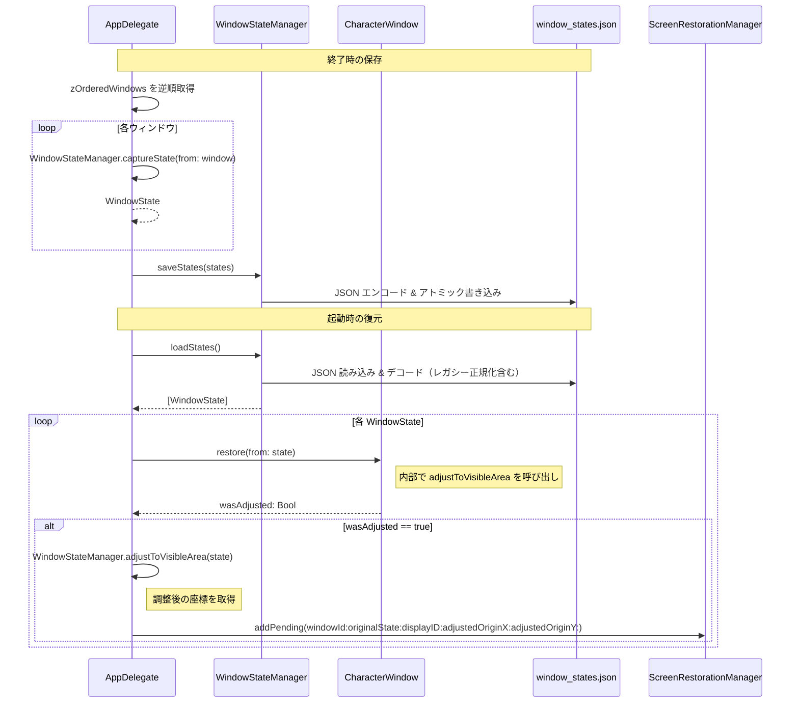
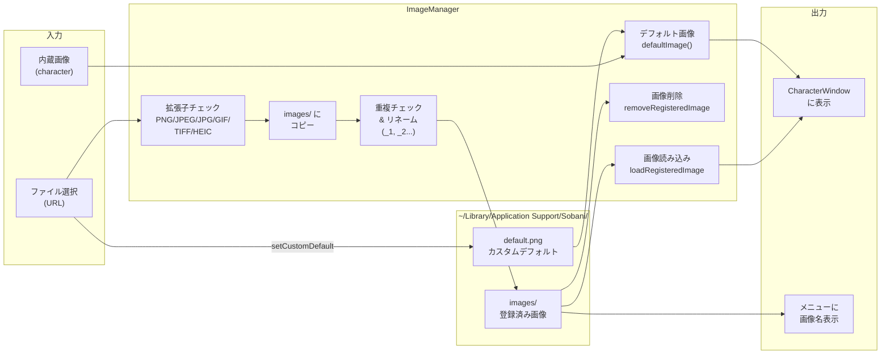

# データの流れ

Sobani のデータ永続化とファイル管理の仕組みを解説します。

[← 目次](README.md)

---

## 保存先一覧

すべての永続化データは以下のディレクトリに格納されます。

```
~/Library/Application Support/Sobani/
├── images/                      # 登録済み画像
│   ├── foo.png
│   └── bar.jpg
├── default.png                  # カスタムデフォルト画像（任意）
├── window_states.json           # ウィンドウ状態（自動生成）
└── pending_restorations.json    # 画面復元待ちキュー（自動生成・一時的）
```

| ファイル / ディレクトリ | 管理クラス | 説明 |
|---|---|---|
| `images/` | `ImageManager` | ユーザーが登録した画像を保持する |
| `default.png` | `ImageManager` | カスタムデフォルト画像。存在しない場合は内蔵の `character` アセットを使用 |
| `window_states.json` | `WindowStateManager` | 終了時にウィンドウの位置・サイズ・状態を保存し、次回起動時に復元する |
| `pending_restorations.json` | `ScreenRestorationManager` | モニター切断・スリープ後の復元待ちキュー。復元完了後は削除される |

---

## ウィンドウ状態の保存・復元

### WindowState の構造

`WindowStateManager` が扱う `WindowState` 構造体のフィールドは以下のとおりです。

| フィールド | 型 | 説明 | デフォルト |
|---|---|---|---|
| `imageName` | `String` | 画像名（`"default"` または登録名） | — |
| `originX` | `CGFloat` | 画像領域の左下 X 座標（ウィンドウ中心と画像サイズから算出） | — |
| `originY` | `CGFloat` | 画像領域の左下 Y 座標（ウィンドウ中心と画像サイズから算出） | — |
| `width` | `CGFloat` | 表示中の画像幅 | — |
| `height` | `CGFloat` | 表示中の画像高さ | — |
| `isFlippedHorizontally` | `Bool` | 左右反転状態 | `false` |
| `rotationAngle` | `CGFloat` | 回転角度（0–360°） | `0` |
| `opacityLevel` | `CGFloat` | 透明度（0.1–1.0） | `1.0` |
| `windowId` | `Int` | ウィンドウ識別子（旧バージョン互換用デフォルト 0） | `0` |

> **注**: Z-order はウィンドウ状態の配列順で表現されます（構造体のフィールドではありません）。保存時は背面→前面の順で格納され、復元時に逆順にすることで正しい重なり順を再現します。

### 保存・復元フロー

終了時には Z-order を保ちながら各ウィンドウの状態をキャプチャして JSON に書き込みます。起動時は JSON を読み込み、画面外に位置するウィンドウを `ScreenRestorationManager` に委譲しつつ各ウィンドウを再生成します。



#### レガシー正規化

`loadStates()` はデコード後に後方互換性のための正規化を行います。旧バージョンで使用されていた `"デフォルト"` という画像名は、読み込み時に自動的に `"default"` へ変換されます。

#### 可視性チェックの条件

`isPositionVisible` は、ウィンドウの矩形がいずれかのスクリーンと **50×50px 以上** 交差している場合に `true` を返します。この閾値は `AppConstants.screenIntersectionThreshold` で定義されています。画面外と判定された場合は `WindowStateManager.adjustToVisibleArea` でメイン画面の中央付近に移動したうえで、元の状態を `ScreenRestorationManager` の復元待ちキューに追加します。

---

## 画像管理のデータフロー

`ImageManager` はシングルトンとして動作し、画像の登録・読み込み・削除・デフォルト画像の管理を一元的に担います。



#### 主な操作

| メソッド | 説明 |
|---|---|
| `registerImage(from:)` | 拡張子チェック後に `images/` へコピー。ファイル名が重複する場合は `_1`, `_2` のサフィックスを付与して登録名を返す |
| `loadRegisteredImage(named:)` | パストラバーサル対策を行いつつ `images/` から画像を読み込む |
| `removeRegisteredImage(named:)` | パストラバーサル対策後に `images/` からファイルを削除する |
| `defaultImage()` | `default.png` が存在すればそれを返し、なければ内蔵の `character` アセットを返す |
| `registeredImageNames()` | 登録済み画像名をソート済みリストで返す。メニューへの画像名表示に使用 |
| `setCustomDefault(from:)` | 指定 URL のファイルを `default.png` としてコピーする |
| `resetCustomDefault()` | `default.png` を削除して内蔵画像に戻す |

---

## Z-order 管理

`AppDelegate` は `zOrderedWindows` 配列でウィンドウの重なり順を管理します。OS のウィンドウ順序ではなく、この配列を正とします。

```
zOrderedWindows[0]  →  最前面（frontmost）
zOrderedWindows[1]
...
zOrderedWindows[N]  →  最背面（backmost）
```

| 操作 | 内部処理 |
|---|---|
| `moveWindowToFront` | 対象をインデックス 0 へ移動 |
| `moveWindowForward` | 対象のインデックスを −1 |
| `moveWindowBackward` | 対象のインデックスを +1 |
| `moveWindowToBack` | 対象を末尾へ移動 |

変更後は `applyZOrderToWindows()` が呼ばれ、配列を逆順にイテレートし、最初のウィンドウ（最背面）は `orderFront(nil)` で表示し、以降のウィンドウは `order(.above, relativeTo:)` で前のウィンドウの上に配置することで、配列の順序が画面の重なり順に反映されます。

---

[← 目次](README.md)
