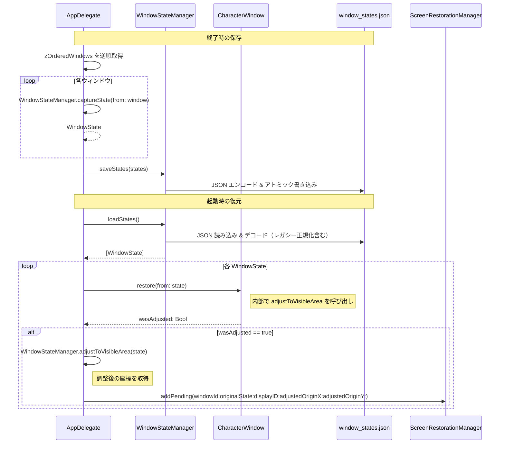
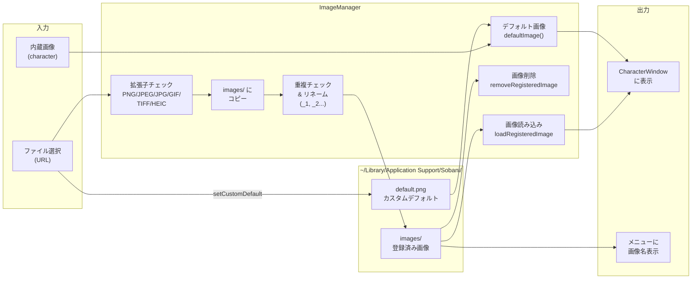
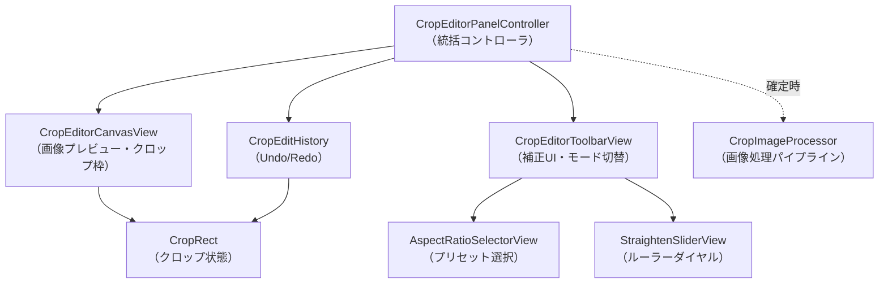
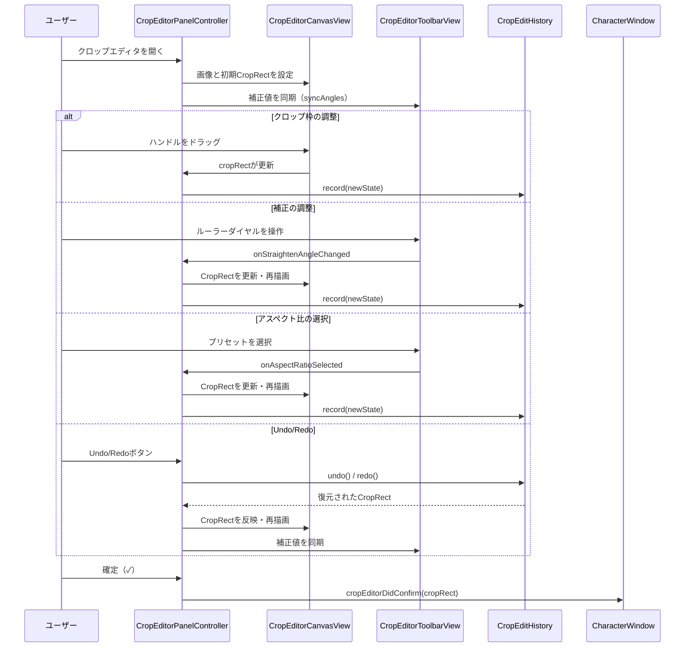

# データの流れ

Sobani のデータ永続化とファイル管理の仕組みを解説します。

[← 目次](README.md)

---

## 保存先一覧

すべての永続化データは以下のディレクトリに格納されます。

```
~/Library/Application Support/Sobani/
├── images/                      # 登録済み画像
│   ├── foo.png
│   └── bar.jpg
├── default.png                  # カスタムデフォルト画像（任意）
├── window_states.json           # ウィンドウ状態（自動生成）
├── pending_restorations.json    # 画面復元待ちキュー（自動生成・一時的）
└── layouts/                     # レイアウトプリセット（プリセットごとに1つのJSONファイル）
```

| ファイル / ディレクトリ | 管理クラス | 説明 |
|---|---|---|
| `images/` | `ImageManager` | ユーザーが登録した画像を保持する |
| `default.png` | `ImageManager` | カスタムデフォルト画像。存在しない場合は内蔵の `character` アセットを使用 |
| `window_states.json` | `WindowStateManager` | 終了時にウィンドウの位置・サイズ・状態を保存し、次回起動時に復元する |
| `pending_restorations.json` | `ScreenRestorationManager` | モニター切断・スリープ後の復元待ちキュー。復元完了後は削除される |
| `layouts/` | `LayoutPresetManager` | レイアウトプリセット。プリセットごとに1つのJSONファイルを保持する |

---

## ウィンドウ状態の保存・復元

### WindowState の構造

`WindowStateManager` が扱う `WindowState` 構造体のフィールドは以下のとおりです。

| フィールド | 型 | 説明 | デフォルト |
|---|---|---|---|
| `imageName` | `String` | 画像名（`"default"` または登録名） | — |
| `originX` | `CGFloat` | 画像領域の左下 X 座標（ウィンドウ中心と画像サイズから算出） | — |
| `originY` | `CGFloat` | 画像領域の左下 Y 座標（ウィンドウ中心と画像サイズから算出） | — |
| `width` | `CGFloat` | 表示中の画像幅 | — |
| `height` | `CGFloat` | 表示中の画像高さ | — |
| `isFlippedHorizontally` | `Bool` | 左右反転状態 | `false` |
| `rotationAngle` | `CGFloat` | 回転角度（0–360°） | `0` |
| `opacityLevel` | `CGFloat` | 透明度（0.1–1.0） | `1.0` |
| `windowId` | `Int` | ウィンドウ識別子（旧バージョン互換用デフォルト 0） | `0` |
| `cropRect` | `CropRect?` | クロップ状態（詳細は下記の CropRect 構造体を参照）、nilはクロップなし | `nil` |
| `isGhostMode` | `Bool` | ゴーストモード（クリックスルー）の状態 | `false` |
| `customGhostAlpha` | `CGFloat?` | ゴーストモード個別透明度（nilはグローバル設定に従う） | `nil` |

> **注**: `cropRect` は `decodeIfPresent` を使用してデコードされるため、cropRectフィールドが無い既存JSONも正常に読み込み可能です（後方互換性）。

> **注**: `isGhostMode` と `customGhostAlpha` も `decodeIfPresent` でデコードされるため、旧バージョンのJSONとの後方互換性があります。

> **注**: Z-order はウィンドウ状態の配列順で表現されます（構造体のフィールドではありません）。保存時は背面→前面の順で格納され、復元時に逆順にすることで正しい重なり順を再現します。

### CropRect の構造

`CropRect` は画像のクロップ状態を表す構造体です。`WindowState` 内にオプショナルとして保持され、クロップ編集の全情報を永続化します。

| フィールド | 型 | 説明 | デフォルト |
|---|---|---|---|
| `x` | `CGFloat` | クロップ領域の正規化 X 座標（0.0〜1.0） | — |
| `y` | `CGFloat` | クロップ領域の正規化 Y 座標（0.0〜1.0） | — |
| `width` | `CGFloat` | クロップ領域の正規化幅（0.0〜1.0） | — |
| `height` | `CGFloat` | クロップ領域の正規化高さ（0.0〜1.0） | — |
| `straightenAngle` | `CGFloat` | 傾き補正角度（-45°〜+45°） | `0` |
| `quarterTurns` | `Int` | 90度回転回数（0〜3） | `0` |
| `isFlippedInCrop` | `Bool` | クロップ内での水平反転フラグ | `false` |
| `aspectRatioPreset` | `String?` | 選択中のアスペクト比プリセット名 | `nil` |
| `verticalPerspective` | `CGFloat` | 垂直パースペクティブ補正（-45°〜+45°） | `0` |
| `horizontalPerspective` | `CGFloat` | 水平パースペクティブ補正（-45°〜+45°） | `0` |

> **注**: すべてのフィールドは `decodeIfPresent` でデコードされるため、旧バージョンで保存されたJSONファイル（フィールドが不足するもの）も正常に読み込めます（後方互換性）。

> **注**: `CropRect.full`（x=0, y=0, width=1, height=1、その他デフォルト値）は画像全体を示す特別な値です。

### 保存・復元フロー

終了時には Z-order を保ちながら各ウィンドウの状態をキャプチャして JSON に書き込みます。起動時は JSON を読み込み、画面外に位置するウィンドウを `ScreenRestorationManager` に委譲しつつ各ウィンドウを再生成します。



#### レガシー正規化

`loadStates()` はデコード後に後方互換性のための正規化を行います。旧バージョンで使用されていた `"デフォルト"` という画像名は、読み込み時に自動的に `"default"` へ変換されます。

#### 可視性チェックの条件

`isPositionVisible` は、ウィンドウの矩形がいずれかのスクリーンと **50×50px 以上** 交差している場合に `true` を返します。この閾値は `AppConstants.screenIntersectionThreshold` で定義されています。画面外と判定された場合は `WindowStateManager.adjustToVisibleArea` でメイン画面の中央付近に移動したうえで、元の状態を `ScreenRestorationManager` の復元待ちキューに追加します。

---

## 画像管理のデータフロー

`ImageManager` はシングルトンとして動作し、画像の登録・読み込み・削除・デフォルト画像の管理を一元的に担います。



> **注**: クロップ編集は非破壊的です。元画像は `images/` にそのまま保持され、`CropRect` の各フィールド（座標、回転、傾き補正、パースペクティブ補正、反転）に基づいて表示が変更されます。確定時に `CropImageProcessor` が画像処理パイプライン（90度回転 → 反転 → パース補正 → 傾き補正 → クロップ）を適用します。

#### 主な操作

| メソッド | 説明 |
|---|---|
| `registerImage(from:)` | 拡張子チェック後に `images/` へコピー。ファイル名が重複する場合は `_1`, `_2` のサフィックスを付与して登録名を返す |
| `loadRegisteredImage(named:)` | パストラバーサル対策を行いつつ `images/` から画像を読み込む |
| `removeRegisteredImage(named:)` | パストラバーサル対策後に `images/` からファイルを削除する |
| `defaultImage()` | `default.png` が存在すればそれを返し、なければ内蔵の `character` アセットを返す |
| `registeredImageNames()` | 登録済み画像名をソート済みリストで返す。メニューへの画像名表示に使用 |
| `setCustomDefault(from:)` | 指定 URL のファイルを `default.png` としてコピーする |
| `resetCustomDefault()` | `default.png` を削除して内蔵画像に戻す |

---

## レイアウトプリセットの保存・読み込み

`LayoutPresetManager` はシングルトンとして動作し、ウィンドウ配置のプリセットを `layouts/` ディレクトリにJSON形式で永続化します。

### 保存フロー

1. ユーザーがメニューバー →「レイアウト」→「現在のレイアウトを保存...」を選択
2. `AppDelegate` が全ウィンドウの `WindowState` を取得
3. `LayoutPresetManager.savePreset(name:states:)` でJSON形式で保存
4. 保存先: `~/Library/Application Support/Sobani/layouts/{name}.json`

### 読み込みフロー

1. ユーザーがメニューバー →「レイアウト」→ プリセット名を選択
2. `LayoutPresetManager.loadPreset(named:)` でJSONを読み込み
3. `AppDelegate.applyLayout(_:)` で既存ウィンドウをすべて閉じ、プリセットのウィンドウ状態を復元

### データ構造

`LayoutPreset` 構造体のフィールドは以下のとおりです。

| フィールド | 型 | 説明 |
|---|---|---|
| `name` | `String` | プリセット名 |
| `createdAt` | `Date` | 作成日時（ISO 8601 形式でエンコード） |
| `states` | `[WindowState]` | 保存時の全ウィンドウ状態 |

- ファイル名はプリセット名をサニタイズした文字列 + `.json`
- サニタイズではパストラバーサル防止と禁止文字（`/\:*?"<>|`）の置換を行う

### 主な操作

| メソッド | 説明 |
|---|---|
| `savePreset(name:states:)` | プリセットを JSON にエンコードし `layouts/` にアトミック書き込み |
| `loadPresets()` | `layouts/` 内の全 JSON を読み込み、作成日時の降順でソートして返す |
| `loadPreset(named:)` | 指定名のプリセットを1件読み込む |
| `deletePreset(named:)` | 指定名のプリセットファイルを削除する |
| `presetExists(named:)` | 指定名のプリセットが存在するか確認する |

---

## クロップエディタのデータフロー

クロップエディタは `CropEditorPanelController` が統括し、キャンバス・ツールバー・履歴管理の各コンポーネントを連携させます。

### コンポーネント構成



### 編集フロー



---

## Z-order 管理

`AppDelegate` は `zOrderedWindows` 配列でウィンドウの重なり順を管理します。OS のウィンドウ順序ではなく、この配列を正とします。

```
zOrderedWindows[0]  →  最前面（frontmost）
zOrderedWindows[1]
...
zOrderedWindows[N]  →  最背面（backmost）
```

| 操作 | 内部処理 |
|---|---|
| `moveWindowToFront` | 対象をインデックス 0 へ移動 |
| `moveWindowForward` | 対象のインデックスを −1 |
| `moveWindowBackward` | 対象のインデックスを +1 |
| `moveWindowToBack` | 対象を末尾へ移動 |

変更後は `applyZOrderToWindows()` が呼ばれ、配列を逆順にイテレートし、最初のウィンドウ（最背面）は `orderFront(nil)` で表示し、以降のウィンドウは `order(.above, relativeTo:)` で前のウィンドウの上に配置することで、配列の順序が画面の重なり順に反映されます。

---

[← 目次](README.md)
