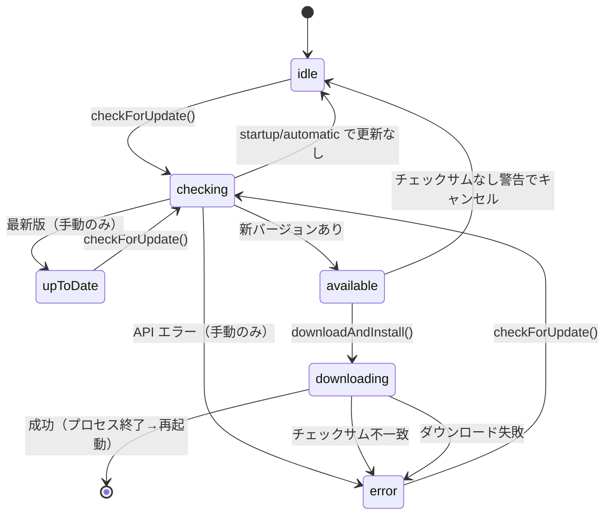
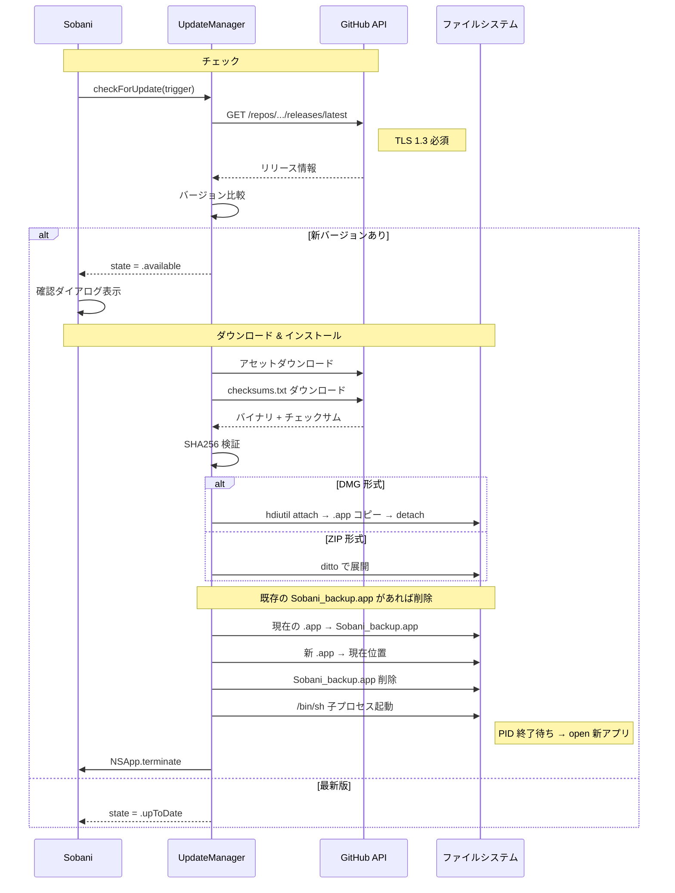
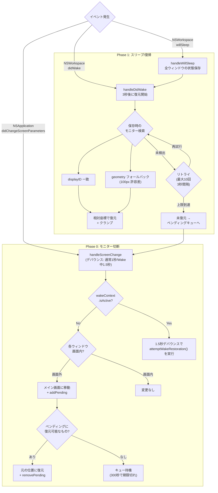

# アップデートと画面復元

自動アップデートの仕組みとモニター切断・スリープ時のウィンドウ位置復元を解説します。

[← 目次](README.md)

---

## 自動アップデート

### チェックタイミング

| トリガー | 発火タイミング | ダイアログ表示 |
|---|---|---|
| `manual` | メニューバーから手動実行 | 全結果（最新版・エラーも含む） |
| `startup` | アプリ起動時 | 更新ありのみ |
| `automatic` | 24時間タイマー / スリープ復帰後（前回から24時間経過時） | なし（サイレント検出、メニューから手動確認可能） |

- 24時間タイマーは `Timer.scheduledTimer(interval: 86400)` で設定されます。
- スリープ復帰時は `NSWorkspace.didWakeNotification` を受信し、前回チェックから24時間経過している場合のみ `.automatic` トリガーで実行されます。

### UpdateState 状態遷移



### アップデート全体フロー



### SHA256 検証

リリースアセットに `checksums.txt` が存在する場合、ダウンロード後に Apple CryptoKit を使って SHA256 チェックサムを検証します。

- `checksumURL` が存在 → `checksums.txt` を取得 → ダウンロード済みファイルの SHA256 と照合
- 不一致 → `state = .error(L("update.checksum_failed"))` としてインストールを中断
- `checksumURL` が存在しない → 警告ダイアログを表示し、ユーザーが続行またはキャンセルを選択

### 再起動メカニズム

新しいアプリを配置した後、現在のプロセスをそのまま終了するのではなく、`/bin/sh` の子プロセスを先に起動してから終了します。

```
/bin/sh -c "while kill -0 <PID> 2>/dev/null; do sleep 0.1; done; open \"<APP_PATH>\""
```

- 子プロセスは親プロセス（現在の Sobani）の PID が消えるまでポーリングを続けます。
- `2>/dev/null` により、プロセスが終了した際に `kill -0` が出力するエラーメッセージを抑制します。
- `<APP_PATH>` はダブルクォートで囲まれており、パスにスペースが含まれる場合も正しく処理されます。
- PID が消えた（= 終了した）ことを確認してから `open` コマンドで新しいアプリを起動します。
- この方式により、ファイル置き換えと再起動の競合状態を回避できます。

---

## 画面復元

モニターの切断やスリープ/復帰が発生した際に、ウィンドウの位置を自動的に復元する仕組みです。3つのフェーズで構成されています。

### 3フェーズの概要



### Phase 0: モニター切断

`NSApplication.didChangeScreenParametersNotification` を受信したとき、デバウンス（通常1秒、Wake中1.5秒）後に `handleScreenChange` がデバウンスタイマー経由で `attemptPendingRestorations()` を呼び出し、実際のオフスクリーン検出とウィンドウ移動処理が実行されます。

**処理の流れ:**

1. `wakeContext.isActive` が `true` の場合はスリープ/復帰処理中（Phase 1）として委譲し、Phase 0 の処理はスキップします。
2. `attemptPendingRestorations()` 内で全ウィンドウの位置を確認し、いずれかの画面内に収まっているか検査します。
   - 画面外のウィンドウ → メイン画面の表示可能領域に移動し、`displayID: 0` としてペンディングキューに追加します。
3. 既存のペンディングキューを確認し、元のモニターが再接続されている場合は元の位置に復元して `removePending` します。

### Phase 1: スリープ/復帰

**スリープ前 (`handleWillSleep`):**

- ペンディングキューと `wakeContext` をクリアします。
- 全ウィンドウの現在の状態（位置・サイズ・`displayID`・画面フレーム・ウィンドウの生の origin（captureState の座標変換を回避））をスナップショットとして `wakeContext` に保存します。

**復帰後 (`handleDidWake`):**

- `wakeContext.isActive = true`、`retryCount = 0` に設定します。
- 3秒の遅延後に `attemptWakeRestoration` を開始します（macOS がモニターを再認識する時間を確保するため）。
- 各ウィンドウについて、スリープ前に記録した `displayID` と一致するモニターを検索します。
  - **displayID 一致**: そのモニター上の相対座標で復元し、画面内にクランプします。
  - **geometry フォールバック**: `displayID` が一致しない場合、スクリーンフレームの位置を 100px の許容差で比較し、最も近いモニターに復元します。
  - **未検出**: リトライキューに入れます。
- リトライは最大10回、3秒間隔で実行されます。
- 最初の2回（インクリメント後の retryCount ≤ 2）は成功しても、macOS の自動移動に対抗するための追加リトライも実行します。
- 最大リトライ回数に達した後も未復元のウィンドウは `moveUnrestoredToPendingQueue` でペンディングキューに移行し、`wakeContext` をクリアします。

### Phase 2: モニター再接続（ペンディングキュー）

`ScreenRestorationManager` がペンディング状態のウィンドウ情報を `pending_restorations.json` に永続化します。

| 項目 | 内容 |
|---|---|
| 保存場所 | `~/Library/Application Support/Sobani/pending_restorations.json` |
| タイムアウト | 300秒（期限切れエントリは自動削除） |
| 復元条件 | `displayID` の一致、または保存時の画面フレームとの geometry マッチ。`displayID` が 0 の場合は元の位置が画面上に表示可能かで判定 |

**`PendingRestoration` の主なフィールド:**

```swift
struct PendingRestoration: Codable {
    let windowId: Int
    let originalState: WindowState
    let displayID: CGDirectDisplayID
    let adjustedOriginX: CGFloat
    let adjustedOriginY: CGFloat
    let createdAt: Date
    let screenFrameX: CGFloat?
    let screenFrameY: CGFloat?
    let screenFrameWidth: CGFloat?
    let screenFrameHeight: CGFloat?
}
```

`restorableEntries()` を呼び出すと、期限切れエントリを除去した上で、現在接続されているモニターと `displayID` または geometry が一致するエントリを返します。一致したエントリは元の位置に復元され、`removePending` でキューから削除されます。

---

[← 目次](README.md)
