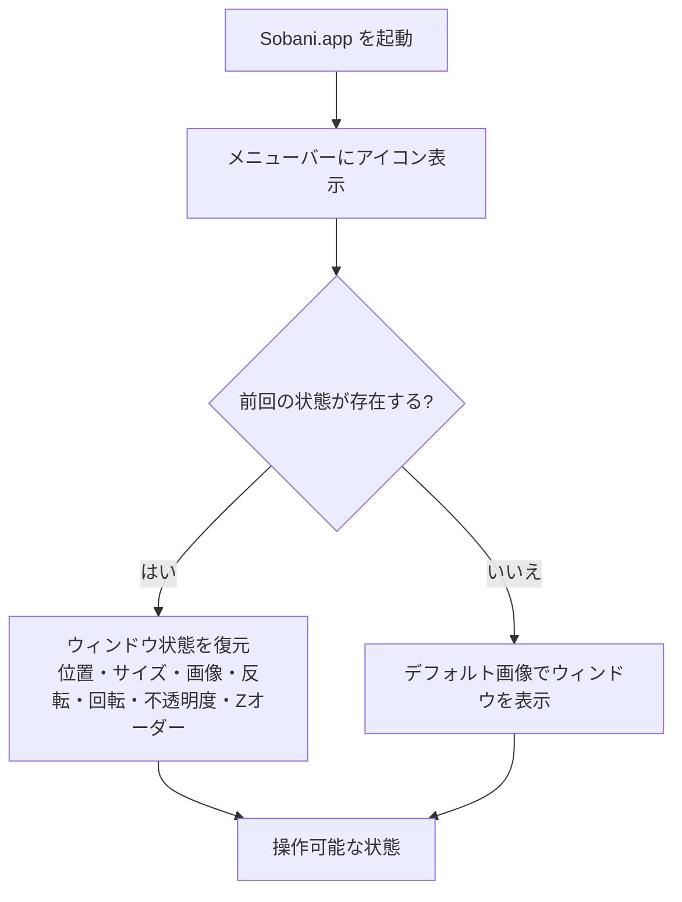
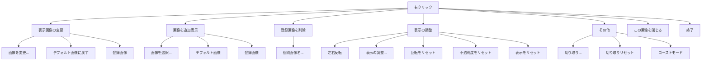
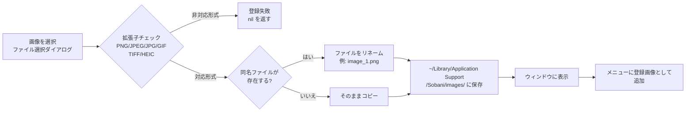

[目次](README.md)

# 操作ガイド

Sobani の操作方法をビジュアルに解説します。

---

## 起動の流れ

アプリを起動すると、メニューバーにアイコンが表示されます。前回の状態が保存されている場合はそれを復元し、初回起動時はデフォルト画像でウィンドウが表示されます。

---

## メニュー構造

### 図A: ステータスバーメニュー構造

メニューバーのアイコンをクリックすると、以下の構造のメニューが表示されます。

```mermaid
flowchart TD
    ICON[メニューバーアイコン] --> ABOUT["Sobani について..."]
    ICON --> UPDATE["更新を確認..."]
    ICON --> SEP1[---]
    ICON --> ADD[画像を追加表示]
    ADD --> ADD_FILE["画像を選択..."]
    ADD --> ADD_DEFAULT["デフォルト画像"]
    ADD --> ADD_REG["登録画像"]
    ICON --> WINDOWS[表示中: X体]
    WINDOWS --> WIN_LIST[ウィンドウ一覧<br/>Zオーダー順]
    WIN_LIST --> WIN_ACTIONS[各ウィンドウの操作]
    WIN_ACTIONS --> LAYER_FRONT["最前面へ移動"]
    WIN_ACTIONS --> LAYER_FORWARD["前面へ移動"]
    WIN_ACTIONS --> LAYER_BACKWARD["背面へ移動"]
    WIN_ACTIONS --> LAYER_BACK["最背面へ移動"]
    WIN_ACTIONS --> FLIP[左右反転]
    WIN_ACTIONS --> ADJUST["表示の調整..."]
    WIN_ACTIONS --> RESET_ROT_W["回転をリセット"]
    WIN_ACTIONS --> RESET_OPA_W["不透明度をリセット"]
    WIN_ACTIONS --> RESET_DISP["表示をリセット"]
    WIN_ACTIONS --> GHOST_W["ゴーストモード"]
    WIN_ACTIONS --> GHOST_ALPHA_W["ゴースト不透明度"]
    WIN_ACTIONS --> CLOSE_ONE["この画像を閉じる"]
    ICON --> SEP2[---]
    ICON --> TOGGLE[すべて非表示 / すべて表示]
    ICON --> FRONT[すべて手前に表示]
    ICON --> LAYOUT[レイアウト]
    LAYOUT --> LAYOUT_SAVE["現在のレイアウトを保存..."]
    LAYOUT --> LAYOUT_NEW["新しいレイアウトを作成..."]
    LAYOUT --> LAYOUT_PRESETS["保存済みプリセット名"]
    LAYOUT --> LAYOUT_OVERWRITE["上書き保存"]
    LAYOUT --> LAYOUT_DELETE["削除"]
    ICON --> SEP3[---]
    ICON --> BULK_RESET[一括リセット]
    BULK_RESET --> RESET_ROT["すべての画像の回転をリセット"]
    BULK_RESET --> RESET_OPA["すべての画像の不透明度をリセット"]
    ICON --> CLOSE_ALL[すべて閉じる]
    ICON --> SEP4[---]
    ICON --> SETTINGS[設定]
    SETTINGS --> LOGIN["ログイン時に起動"]
    SETTINGS --> CHANGE_DEFAULT["デフォルト画像を変更..."]
    SETTINGS --> RESET_DEFAULT[デフォルト画像をリセット]
    SETTINGS --> LANG["言語 / Language"]
    LANG --> LANG_SYS["システム設定に従う"]
    LANG --> LANG_JA[日本語]
    LANG --> LANG_EN[English]
    SETTINGS --> GHOST_ALPHA["ゴーストモードの不透明度"]
    ICON --> ONBOARDING["使い方ガイドを表示"]
    ICON --> SEP5[---]
    ICON --> QUIT[終了]
```

**図A 補足:**

- **「表示中: X体」**: ウィンドウが非表示状態のときは「非表示中: X体」に動的に変化します。
- **「すべて非表示 / すべて表示」**: 実際にはウィンドウの表示状態に応じてどちらか一方のみ表示されます。表示中は「すべて非表示」、非表示中は「すべて表示」になります。
- **設定 > デフォルト画像をリセット**: カスタムデフォルト画像が設定されている場合のみ表示されます。
- **「登録画像」**: 無効化されたセクションヘッダーで、その下に登録済みの個別画像名がメニュー項目として並びます。

### 図B: 右クリックメニュー構造

キャラクターウィンドウを右クリックすると、以下の構造のコンテキストメニューが表示されます。

**図B 補足:**

- **「登録画像」**: 図A と同様に、無効化されたセクションヘッダーの下に個別の画像名が並びます。
- **「登録画像を削除」**: セクションヘッダーはなく、個別の画像名が直接メニュー項目として並びます。

---

## 画像管理の流れ

Sobani では、PNG・JPEG/JPG・GIF・TIFF・HEIC 形式の画像を登録して使用できます。登録した画像は `~/Library/Application Support/Sobani/images/` に保存され、アプリを再起動しても引き続き利用できます。

### 図C: 画像の登録から表示までの流れ

通常はファイル選択ダイアログで対応形式のみ表示されるため、このパスに到達することはありません。

登録済みの画像はステータスバーメニューおよび右クリックメニューの「登録画像」サブメニューから選択できます。不要になった画像は右クリックメニューの「登録画像を削除」から削除できます。

---

## マウス操作

| 操作 | 動作 |
|------|------|
| ドラッグ | ウィンドウを移動 |
| `Option` + ドラッグ | すべてのウィンドウを同時に移動 |
| ダブルクリック | フローティングメニューを表示 |
| スクロールホイール | ウィンドウサイズを変更（100px〜6000px）※ |
| `Option` + スクロールホイール | すべてのウィンドウのサイズを同時に変更 |
| 調整パネルが開いている状態でスクロールホイール | 回転角度を変更 |

※ 6000pxは、画像回転時のGPUレンダリング互換性を考慮した上限値です。

---

## 調整パネル

調整パネルでは、キャラクターの回転角度と不透明度を細かく調整できます。

- **回転ダイアル**: 0°〜360° の範囲でドラッグ操作により回転を指定します。5° 単位でスナップします。ダイアル横のテキストフィールドに直接数値を入力して角度を指定することもできます。調整パネルが開いている状態では、スクロールホイールでも回転を変更できます。
- **不透明度スライダー**: 10%〜100% の範囲で不透明度を調整します。

調整パネルはステータスバーメニューの「表示中」サブメニュー内の各ウィンドウ操作、または右クリックメニューの「表示の調整 → 表示の調整...」から起動できます。

---

## フローティングメニュー

キャラクターウィンドウをダブルクリックすると、フローティングメニューが表示されます。各ボタンにはアイコンとテキストラベルが表示され、よく使う操作にすばやくアクセスできます。

### ボタン一覧

| ボタン | 動作 |
|--------|------|
| 切り取り | 切り取りモードを開始 |
| 左右反転 | 画像を左右反転 |
| 調整パネル | 調整パネルを開く |
| 背景を削除 | 画像の背景を削除 |
| ゴースト | ゴーストモードを切り替え |
| 表示をリセット | 画像の切り取り・反転・回転・不透明度・サイズ・位置をリセット |
| 閉じる | ウィンドウを閉じる |

フローティングメニューは、メニュー外をクリックするか `ESC` キーを押すと閉じます。

---

## ゴーストモード

ゴーストモードを有効にすると、ウィンドウがクリックを通過するようになります（マウスイベントを無視）。有効中はウィンドウが半透明（デフォルト30%）になり、ゴーストのような外観になります。

### トグル方法

| 方法 | 操作 |
|------|------|
| グローバルホットキー | `Option+G` ですべてのウィンドウを一括切り替え |
| 右クリックメニュー | 「その他」→「ゴーストモード」で個別に切り替え |
| フローティングメニュー | 「ゴースト」ボタンで個別に切り替え |
| ステータスバーメニュー | 「表示中」サブメニュー内の各ウィンドウ操作から切り替え |

### 不透明度のカスタマイズ

- ステータスバーメニュー →「設定」→「ゴーストモードの不透明度」でグローバルのデフォルト不透明度を変更可能（10%〜90%）
- 「表示中」サブメニュー →「ゴースト不透明度」で個別ウィンドウの不透明度をカスタマイズ可能
- 個別設定をリセットすると、グローバル設定に戻ります

> ゴーストモード中はマウス操作を受け付けないため、解除するにはグローバルホットキー（Option+G）またはステータスバーメニューを使用してください。

---

## クロップエディタ（画像の切り取り）

iPhone 写真アプリ風のクロップエディタで、画像の表示範囲を非破壊で編集できます。元の画像データは変更されないため、いつでもリセットして元の状態に戻せます。

### クロップエディタの開始方法

- フローティングメニュー（ダブルクリック）の「切り取り」ボタン
- 右クリック →「その他」→「切り取り...」

### エディタの構成

クロップエディタはフローティングパネルとして表示され、以下の3つのエリアで構成されます。

| エリア | 内容 |
|--------|------|
| トップバー | キャンセル（×）、Undo/Redo、確定（✓）、反転/90度回転、戻す、モード切り替え |
| キャンバス | 画像プレビュー、クロップ枠（8つのハンドル）、グリッド表示 |
| ツールバー | 補正モード時: ルーラーダイヤル + モードボタン、アスペクト比モード時: プリセットボタン |

### キャンバスの操作

- **ハンドルドラッグ**: クロップ枠の四隅と各辺中央に計 8 つのハンドルが表示されます。ハンドルをドラッグしてクロップ領域を調整します。
- **画像のパン**: 画像をドラッグして表示位置を調整できます。
- **ズーム**: スクロールホイールで画像を拡大・縮小できます（1.0倍〜10.0倍）。

### 補正モード

ツールバー下部の3つのモードボタンで、補正の種類を切り替えます。各モードの補正量はプログレスアークで可視化されます。

| モード | アイコン | 説明 |
|--------|----------|------|
| 傾き補正 | `level` | 水平方向の傾きを -45°〜+45° の範囲で補正 |
| 垂直パースペクティブ | `trapezoid.and.line.vertical` | 垂直方向の遠近感を補正 |
| 水平パースペクティブ | `trapezoid.and.line.horizontal` | 水平方向の遠近感を補正 |

ルーラーダイヤルを左右にドラッグして角度を調整します。慣性スクロールに対応しています。

### アスペクト比プリセット

トップバーのモード切り替えボタンでアスペクト比モードに切り替えると、以下のプリセットから選択できます。

| プリセット | 説明 |
|------------|------|
| フリー | 自由な比率でクロップ |
| オリジナル | 元の画像の比率を維持 |
| 1:1 | 正方形 |
| 3:2 / 2:3 | 写真の標準比率 |
| 4:3 / 3:4 | デジカメの標準比率 |
| 16:9 / 9:16 | ワイドスクリーン比率 |

### その他の操作

| 操作 | 説明 |
|------|------|
| 90度回転 | トップバーのボタンで画像を90度ずつ回転 |
| 左右反転 | トップバーのボタンで画像を水平方向に反転 |
| Undo/Redo | トップバーのボタンで編集操作の取り消し・やり直し |
| 戻す | すべての編集をリセットして初期状態に戻す（黄色のボタン） |

### 確定・キャンセル

| 操作 | 説明 |
|------|------|
| ✓（確定） | 現在の編集内容を適用してエディタを閉じる。変更がある場合はボタンが緑色で表示 |
| ×（キャンセル） | 編集を破棄してエディタを閉じる |
| `ESC` キー | キャンセルと同じ動作 |

### 切り取りのリセット

適用済みの切り取りは、右クリック →「その他」→「切り取りリセット」でいつでもリセットできます。

---

## レイアウトプリセット

現在のウィンドウ配置（画像・位置・サイズ・回転角度・不透明度）を名前を付けて保存し、ワンクリックで復元できます。

### プリセットを保存する

メニューバーのアイコン →「レイアウト」→「現在のレイアウトを保存...」→ 名前を入力して保存。

### プリセットを読み込む

メニューバーのアイコン →「レイアウト」→ 保存済みプリセット名をクリック。既存のウィンドウはすべて閉じられ、プリセットの配置が復元されます。

### プリセットを上書き保存する

メニューバーのアイコン →「レイアウト」→「上書き保存」→ 上書きするプリセットを選択。

### プリセットを削除する

メニューバーのアイコン →「レイアウト」→「削除」→ 削除するプリセットを選択。

### 新しいレイアウトを作成する

メニューバーのアイコン →「レイアウト」→「新しいレイアウトを作成...」→ 名前を入力。デフォルト画像1体のプリセットが作成され、すぐに適用されます。

---

## キーボードショートカット

以下のキーは右クリックメニュー（コンテキストメニュー）が開いているとき、またはステータスバーメニューが開いているときに有効なショートカットです。`Option+H` のみシステム全体で有効なグローバルホットキーです。

| キー | 動作 | コンテキスト |
|------|------|------------|
| `d` | デフォルト画像に戻す | 右クリック > 表示画像の変更 |
| `o` | 画像を変更 | 右クリック > 表示画像の変更 |
| `n` | デフォルト画像で追加表示 | 右クリック > 画像を追加表示 |
| `w` | ウィンドウを閉じる | 右クリックメニュー |
| `f` | すべて手前に表示 | ステータスバーメニュー |
| `Option+H` | 表示/非表示切り替え | ステータスバーメニュー / グローバルホットキー（常に有効） |
| `Option+G` | ゴーストモード切り替え | ステータスバーメニュー / グローバルホットキー（常に有効） |
| `q` | 終了 | 右クリックメニュー / ステータスバーメニュー |

---

## 対応画像形式

以下の画像形式をサポートしています。

| 形式 | 拡張子 | 備考 |
|------|--------|------|
| PNG | `.png` | 推奨。透過対応でアクスタ風表示に最適 |
| JPEG | `.jpeg`, `.jpg` | スマホ写真など |
| GIF | `.gif` | — |
| TIFF | `.tiff` | — |
| HEIC | `.heic` | iPhone の標準撮影形式 |

> 透明な背景でキャラクターを表示するため、**透過処理された PNG 画像の使用を推奨**します。背景のある画像は「背景を除去」でワンクリック切り抜きできます。

---

[目次](README.md)
