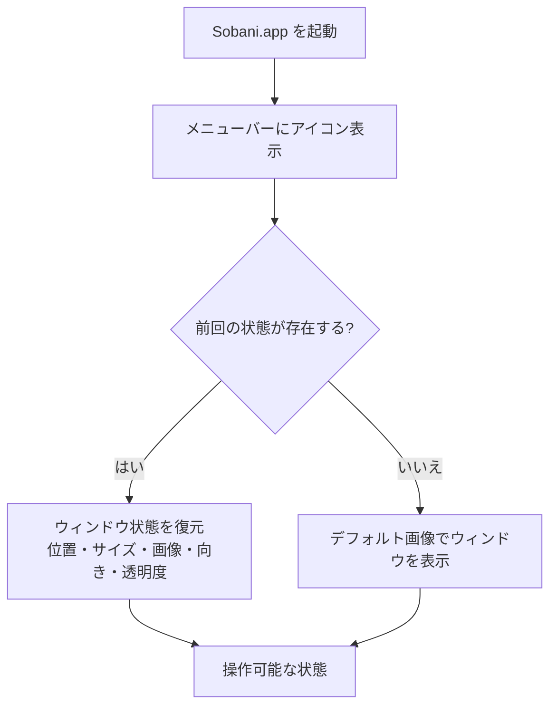
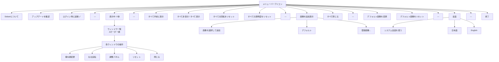
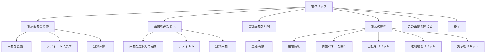
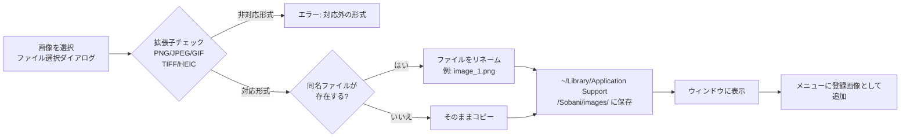

[目次](README.md)

# 操作ガイド

Sobani の操作方法をビジュアルに解説します。

---

## 起動の流れ

アプリを起動すると、メニューバーにアイコンが表示されます。前回の状態が保存されている場合はそれを復元し、初回起動時はデフォルト画像でウィンドウが表示されます。

---

## メニュー構造

### 図A: ステータスバーメニュー構造

メニューバーのアイコンをクリックすると、以下の構造のメニューが表示されます。

### 図B: 右クリックメニュー構造

キャラクターウィンドウを右クリックすると、以下の構造のコンテキストメニューが表示されます。

---

## 画像管理の流れ

Sobani では、PNG・JPEG・GIF・TIFF・HEIC 形式の画像を登録して使用できます。登録した画像は `~/Library/Application Support/Sobani/images/` に保存され、アプリを再起動しても引き続き利用できます。

### 図C: 画像の登録から表示までの流れ

登録済みの画像はステータスバーメニューおよび右クリックメニューの「登録画像」サブメニューから選択できます。不要になった画像は右クリックメニューの「登録画像を削除」から削除できます。

---

## 調整パネル

調整パネルでは、キャラクターの回転角度と透明度を細かく調整できます。

- **回転ダイアル**: 0°〜360° の範囲でドラッグ操作により回転を指定します。5° 単位でスナップします。
- **透明度スライダー**: 10%〜100% の範囲で透明度を調整します。

調整パネルはステータスバーメニューの「表示中」サブメニュー内の各ウィンドウ操作、または右クリックメニューの「表示の調整 → 調整パネルを開く」から起動できます。

---

## キーボードショートカット

| キー | 動作 |
|------|------|
| `d` | デフォルト画像に戻す |
| `o` | 画像を変更 |
| `n` | 新しいウィンドウを開く |
| `w` | ウィンドウを閉じる |
| `f` | すべて手前に表示 |
| `Option+H` | 表示/非表示切り替え |
| `q` | 終了 |

---

[目次](README.md)
