# Sobani マーケティングフレームワーク分析

## はじめに

本ドキュメントは、macOS向けデスクトップアクスタアプリ「Sobani（そばに）」を対象に、代表的なマーケティングフレームワークを用いて現状を分析し、今後の**汎用アプリ化（App Store配布）**に向けた戦略的示唆を導くことを目的としています。対象読者は、本アプリの開発者・関係者および将来の戦略策定に携わる方です。現在は「推しを、そばに。」というコンセプトで推し活・ファン向けに訴求していますが、機能的には「任意の画像を最前面に常時表示する汎用ツール」としての価値も高く、そのポテンシャルを最大化するための戦略分析を行います。各フレームワークでは「現状（デスクトップアクスタアプリとして）」と「汎用アプリ化した場合」の2軸で考察します。

## Executive Summary

18のマーケティングフレームワーク分析から、以下の戦略的インサイトが導かれました。

### 1. 汎用アプリ化は「市場開拓戦略」として合理的

SWOT分析・アンゾフのマトリクス・ブルーオーシャン戦略の3フレームワークが一致して示す結論です。Sobaniの技術資産（Vision背景除去・レイアウトプリセット・3フェーズ画面復元など）は、推し活以外のユースケース（参照画像表示・デザイン作業補助・デジタルフォトフレーム）にもそのまま価値を提供できます。既存の競合（Overlay, Floaty, KeepTop等）は機能が限定的であり、Sobani由来の差別化機能群は競合優位性として十分に機能します。

### 2. App Store配布はカスタマージャーニーの全ステージを改善する

カスタマージャーニーマップ・AARRR分析が明らかにした最大のボトルネックは「導入」段階です。GitHub Releases + Gatekeeper警告という現在の配布方法は、非技術者のターゲットユーザー（推し活ファン・一般ユーザー）にとって大きな障壁です。App Store配布により、認知（ASO検索流入）→導入（1タップインストール）→推奨（レビュー・評価）の全ステージが劇的に改善します。

### 3. フリーミアムモデルは「ジョブの段階的拡大」に沿っている

ジョブ理論（JTBD）分析が示すように、ユーザーのジョブは「まず1枚表示したい」（無料で十分）から「複数画像を配置管理したい」（Proの価値を実感）へ段階的に拡大します。無料版の3枚制限→Pro（$4.99）への誘導は、このジョブの自然な拡大曲線に沿った設計です。

### 4. ブランディングの転換が最大の課題

STP分析・ポジショニングマップが示すように、「デスクトップアクスタアプリ」→「画像を常に最前面に表示する汎用ツール」へのポジション転換は、技術的変更よりもメッセージング・ブランディングの刷新が鍵です。「推しを、そばに。」から「どんな画像も、常に目の前に。」への転換により、TAMは日本国内の推し活macOSユーザー225万人から、全世界のmacOSユーザー1.2億人（のうち画像表示需要層600万人）へと大幅に拡大します。

### 5. 既存OSSコミュニティが「初速」の武器になる

AARRR・プロダクトライフサイクル分析が示すように、App Store新規リリースの最大課題は初期レビュー・評価の獲得です。既存のGitHub OSSコミュニティからApp Storeへの移行を促すことで、他の新規アプリにはない「初速」を得られます。これがリーンキャンバスの「Unfair Advantage（参入障壁）」となります。

---

## 1. 3C分析（Company / Customer / Competitor）

### 概要

3C分析は、自社（Company）・顧客（Customer）・競合（Competitor）の3つの視点から事業環境を俯瞰するフレームワークです。3者の交差点に持続可能な競争優位性（KSF: Key Success Factor）を見出すことが目的です。Sobaniの現状と汎用アプリ化後の変化を整理します。

### ひとことで言うと？

> **ひとことで言うと？** 「自分・お客さん・ライバル」の3つを見渡して、自分だけの勝ちパターンを見つけるフレームワーク。文化祭で出店するとき、「自分たちは何が得意？」「お客さんは何を食べたい？」「隣のクラスは何を出す？」を考えるのと同じです。

### 現状分析（デスクトップアクスタアプリとして）

#### Company（自社）

| 項目 | 内容 |
|------|------|
| 強み | MIT完全無料・OSS、Swift 6/Cocoa純正実装、高機能（背景除去・クロップ・管理パネル・3フェーズ画面復元）、軽量（DMG約7.2MB）、ユニバーサルバイナリ対応 |
| 弱み | 個人開発のためリソース・マーケティング予算が限られる、App Store未掲載、知名度が低い |
| リソース | GitHub Releases + Homebrew配布、公式サイト（[シロ.jp/sobani](https://xn--xckxf.jp/sobani/)）、X（Twitter）、個人開発者1名 |
| 技術資産 | Sparkle自動更新、EdDSA署名、Vision背景除去、SwiftUI管理パネル、レイアウトプリセット |
| 収益モデル | 現時点では収益なし（完全無料・OSS） |

#### Customer（顧客）

| ペルソナ | 属性 | ニーズ | 利用シーン |
|----------|------|--------|------------|
| 佐藤 凛（21歳・大学生） | 推し活・アニメファン、MacBook Air M2 | 推しキャラをデスクトップに常時表示したい | 勉強・作業中にモチベーション維持 |
| 田中 幸子（42歳・主婦） | ペット・家族写真、iMac 24インチ | 愛犬の写真を常時表示してほっこりしたい | 在宅ワーク・趣味時間 |
| 中村 拓海（29歳・バックエンドエンジニア） | OSSコントリビューター、MacBook Pro M3 Pro | コード品質への貢献、技術的に面白いツール | 開発時のサブツール・OSSへの関心 |
| 水瀬 あおい（25歳・グラフィックデザイナー） | VTuber、MacBook Pro 16インチ | 配信映えするレイアウト設定をしたい | 配信・動画制作 |
| 橘 さくら（28歳・百貨店販売員） | 女性アイドルファン、MacBook Air M2 | 推しメンの写真を複数枚配置したい | 休憩時・帰宅後の癒し |

#### Competitor（競合）

| 競合アプリ | 種別 | 価格 | 強み | 弱み |
|------------|------|------|------|------|
| Overlay - Screen Tracing | 直接競合 | 無料 | 複数画像対応、クリックスルー | UIが古い、機能が少ない |
| OnScreen (PiP) | 直接競合 | $4.99 | App Store掲載、画面キャプチャPiP | 画像ファイル向きではない |
| Floaty | 間接競合 | 無料+Pro | 任意ウィンドウ最前面固定、Pro機能充実 | 画像特化ではない |
| Hover | 間接競合 | 有料 | リアルタイムウィンドウ複製 | Screen Recording権限必要、特殊用途 |
| KeepTop | 間接競合 | 無料 | シンプル操作 | 機能が少ない、更新頻度低 |

### 汎用アプリ化した場合の変化・提案

| 軸 | 現状 | 汎用アプリ化後の変化 |
|----|------|---------------------|
| Company | 推し活特化ブランド、無料OSS、個人開発 | フリーミアムモデル（無料+Pro $4.99）導入、App Store掲載、英語UI追加、グローバル展開 |
| Customer | 推し活・ファン層（主に日本の10〜30代女性） | ビジネスユーザー（参考画像常時表示）・クリエイター・教育者・デザイナーなど幅広い層に拡大 |
| Competitor | 推し活市場では競合ほぼなし | App Store掲載でOverlay・OnScreen等と直接競合。差別化はUIの洗練度と機能の深さ |

### ダイアグラム

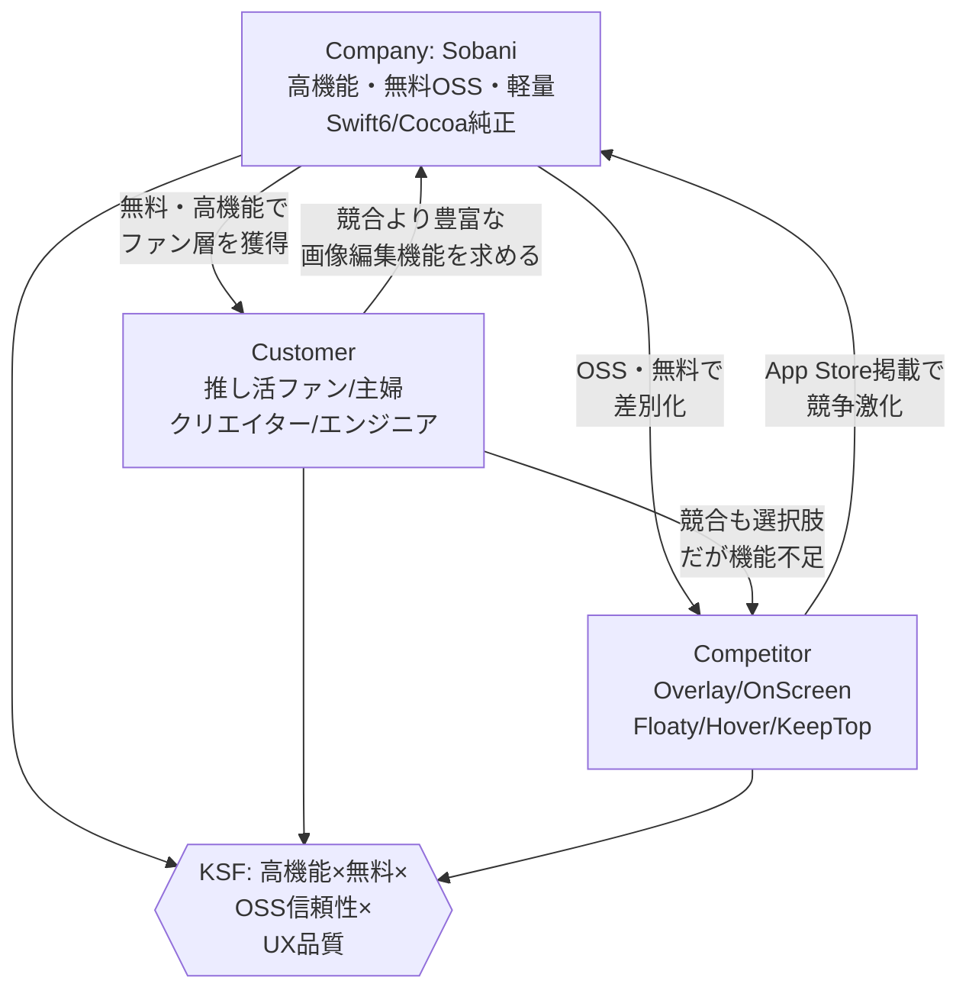

---

## 2. SWOT分析

### 概要

SWOT分析は、内部環境（Strengths・Weaknesses）と外部環境（Opportunities・Threats）を4象限で整理するフレームワークです。内部の強みを活かして機会を掴み、弱みや脅威をどう克服・回避するかを戦略に落とし込みます。

### ひとことで言うと？

> **ひとことで言うと？** 自分の「いいところ・ダメなところ」と、まわりの「チャンス・ピンチ」を4つのマスに整理するフレームワーク。テスト前に「得意科目・苦手科目」と「出やすい範囲・難しくなりそうな範囲」を整理するのに似ています。

### 現状分析

| | プラス要因 | マイナス要因 |
|-|-----------|-------------|
| **内部環境** | **Strengths（強み）** ・完全無料・MIT OSSで信頼性が高い ・Swift 6/Cocoa純正実装で高パフォーマンス ・Vision背景除去・クロップ等の高機能 ・軽量（DMG約7.2MB）かつユニバーサルバイナリ ・自動アップデート（Sparkle+EdDSA署名）完備 ・管理パネル（SwiftUI）・レイアウトプリセット等の差別化機能 ・3フェーズ画面復元でマルチモニター対応が堅牢 ・OSSコミュニティによる潜在的コントリビューター獲得 | **Weaknesses（弱み）** ・個人開発のためリソース・開発速度に限界 ・App Store未掲載で発見可能性が低い ・日本語・英語バイリンガルUI対応済み ・ブランド認知度がほぼゼロ ・マーケティング予算なし ・収益モデルが未確立（完全無料） ・ドキュメント・チュートリアルが少ない ・SNSフォロワー数が少なく拡散力が弱い |
| **外部環境** | **Opportunities（機会）** ・推し活・オタク文化の市場拡大（国内外） ・macOS Appleシリコン普及でユーザー増加 ・VTuber・コンテンツクリエイター市場の成長 ・在宅ワーク普及によるデスクトップカスタマイズ需要増 ・App Store掲載で世界的な発見可能性向上 ・macOS標準APIの充実（Vision Framework等） ・ProductHunt・HackerNewsでのOSS注目 | **Threats（脅威）** ・Apple自身がOSレベルで類似機能を追加する可能性 ・競合アプリのApp Store掲載済み優位性 ・macOSアップデートによるAPI変更リスク ・無料アプリが当たり前の環境での課金障壁 ・推し活ブームが特定IPに依存するリスク ・個人開発者のバーンアウト・開発停止リスク |

### 汎用アプリ化した場合の変化・提案

| SWOT要素 | 現状 | 汎用化後の変化 |
|----------|------|---------------|
| Strengths | 推し活特化の高機能 | 汎用用途でも訴求できる「画像最前面表示ツール」としての強みが明確化 |
| Weaknesses | App Store未掲載 | App Store申請で弱みを直接解消できる |
| Opportunities | 推し活市場 | ビジネス・クリエイター・教育市場も取り込み、市場規模が数十倍に拡大 |
| Threats | 競合との差別化 | フリーミアムモデルで無料競合に対抗しつつ、Pro機能で収益化 |

### ダイアグラム

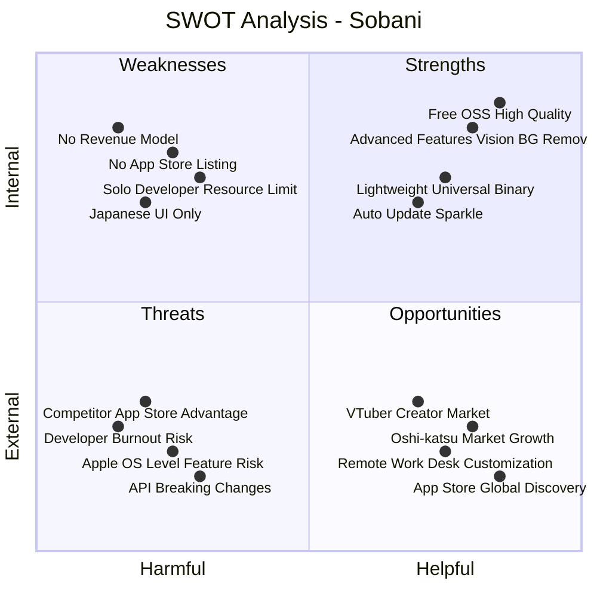

---

## 3. PEST分析

### 概要

PEST分析は、マクロ環境を政治（Political）・経済（Economic）・社会（Social）・技術（Technological）の4要素で分析するフレームワークです。コントロール不可能な外部環境の変化を把握し、機会とリスクを早期に特定することを目的とします。

### ひとことで言うと？

> **ひとことで言うと？** 自分ではコントロールできない「世の中の大きな流れ」を4つの角度（政治・経済・社会・技術）からチェックするフレームワーク。天気予報を見て明日の服装を決めるように、世の中の流れを見てビジネスの準備をします。

### 現状分析

| 要素 | 主要因 | Sobaniへの影響 |
|------|--------|---------------|
| **Political（政治）** | ・App Store審査ポリシー（Apple Developer Guidelines） ・著作権法・著作物の利用規制 ・個人情報保護法（GDPR・個人情報保護法） ・macOS Gatekeeperセキュリティポリシー | App Store未掲載のため現状は審査リスクなし。ただし汎用化でApp Store申請時に審査基準への準拠が必須。著作権については「ユーザー自身の画像を使う」前提のため問題は少ない |
| **Economic（経済）** | ・円安（海外展開時の収益換算に有利） ・macOS搭載Macの販売台数増加（Appleシリコン効果） ・アプリ内課金・買い切りの市場成熟 ・ユーザーの課金意欲（$4.99〜$9.99が妥当と感じる層） | Macユーザー数の増加は直接的な市場拡大。円安は海外ユーザーからの収益を円換算で増大させる。フリーミアム$4.99は価格感度の高い個人ユーザー向けに妥当なライン |
| **Social（社会）** | ・推し活文化の社会的定着と市場規模拡大（日本国内推定数千億円規模） ・VTuber文化のグローバル拡散 ・在宅ワーク・ハイブリッドワークの普及 ・デジタルウェルビーイング・デスクトップ個性化トレンド ・Z世代・α世代のMac利用率上昇 | 推し活文化はSobaniの最大の追い風。VTuberブームが海外展開のきっかけになる可能性が高い。在宅ワーク普及でデスクトップ環境へのこだわりが増しており、Sobaniのニーズが拡大中 |
| **Technological（技術）** | ・Apple Silicon（M1〜M4）のパフォーマンス向上 ・macOS標準API充実（Vision Framework・SwiftUI・Metal） ・Swift 6の並行性モデル（strict concurrency） ・Sparkle等のOSSエコシステム成熟 ・AI画像処理技術の進化（背景除去・拡張） ・macOS Sequoia以降のウィンドウ管理API変化 | Apple Silicon対応（ユニバーサルバイナリ）は既に対応済みで技術的優位性あり。Vision Frameworkによる背景除去はAppleのAI投資の恩恵。Swift 6への移行も完了済みで技術的負債が少ない |

### 汎用アプリ化した場合の変化・提案

| 要素 | 汎用化後の変化 | 対応施策 |
|------|--------------|---------|
| Political | App Store審査ポリシーへの準拠が必須。プライバシーポリシー整備が必要 | 審査ガイドラインの事前チェック、Privacy Nutrition Labelの整備 |
| Economic | Pro $4.99の価格設定で初期収益化。海外市場（USD建て）展開で収益増大 | フリーミアムモデル導入、Paddle/Stripe等での直販も検討 |
| Social | ビジネス・教育・クリエイター層の取り込みで社会的受容性が向上 | 英語対応で海外VTuberファン・クリエイターコミュニティへリーチ |
| Technological | AI画像処理API（背景除去の精度向上）を継続活用。macOSアップデートに追従 | SwiftUI移行のロードマップ検討、Vision Framework最新APIへの継続対応 |

---

## 4. ポーターのファイブフォース

### 概要

ポーターのファイブフォース（Five Forces）は、業界の競争構造を5つの力（新規参入の脅威・代替品の脅威・売り手の交渉力・買い手の交渉力・競合他社の競争）で分析するフレームワークです。業界全体の収益性と参入障壁を評価することができます。

### ひとことで言うと？

> **ひとことで言うと？** 「この商売、儲かりやすいの？大変なの？」を5つの力で判断するフレームワーク。学校の近くにたこ焼き屋を出すとき、「他にたこ焼き屋はある？」「クレープ屋に客を取られない？」「材料は高い？」みたいに考えます。

### 現状分析

| 競争要因 | 強度 | 分析内容 |
|----------|------|---------|
| **新規参入の脅威** | 中〜高 | macOSアプリ開発の技術的ハードルはあるが、Appleのツール（Xcode・SwiftUI）が充実しており参入障壁はそれほど高くない。ただしSobaniレベルの機能（3フェーズ画面復元・クロップエディタ・Vision背景除去）を実装するには相応の技術力が必要 |
| **代替品の脅威** | 中 | Betterzip、Finder、Preview等のmacOS標準機能で「画像を見る」ことは可能。ただし「最前面常時表示」「透過・回転・クロップ」という組み合わせは標準機能では代替不可。間接競合（Floaty・Hover）は別用途に特化しており直接の代替にはなりにくい |
| **売り手の交渉力（供給者）** | 高 | Appleが唯一のプラットフォーム提供者であり、macOSのAPIや審査基準変更は一方的に適用される。Sparkle等のOSS依存も存在するが、OSS自体はリスクが低い。Appleの力が圧倒的に強い |
| **買い手の交渉力（顧客）** | 高 | 現状無料のため顧客の価格交渉力は実質最大。「無料が当たり前」のmacOSフリーアプリ文化の中では、有料化時に離脱リスクが高い。ただし熱狂的なファン層（推し活ユーザー）は継続利用意欲が高い |
| **競合他社の競争** | 中 | 直接競合（Overlay・OnScreen）はApp Store掲載済みで発見可能性が高いが機能が少ない。間接競合（Floaty等）は別軸の競合。現状の「推し活特化」ポジションでは競合がほぼ存在せず、独自市場を形成している |

### 汎用アプリ化した場合の変化・提案

App Store参入により、競争構造が大きく変化します。

| 競争要因 | 変化の方向 | 対応施策 |
|----------|-----------|---------|
| 新規参入の脅威 | 増加（App Storeにより参入が容易になる） | 高機能・高品質・ブランド認知で先行者優位を確立 |
| 代替品の脅威 | やや増加（App Storeで類似アプリが発見されやすくなる） | Vision背景除去・クロップ・レイアウトプリセット等の他にない機能で差別化 |
| 売り手の交渉力 | 変化なし（Appleへの依存は継続） | macOSネイティブAPIに深く依存した機能でプラットフォームロックインを活用 |
| 買い手の交渉力 | 低下（有料化で価値を明示できる） | フリーミアムモデルで無料層を維持しつつPro転換率5-10%を目標 |
| 競合他社の競争 | 増加（App Store上での競合が可視化される） | ASO（App Store Optimization）・レビュー獲得・ブランドストーリーで差別化 |

### ダイアグラム

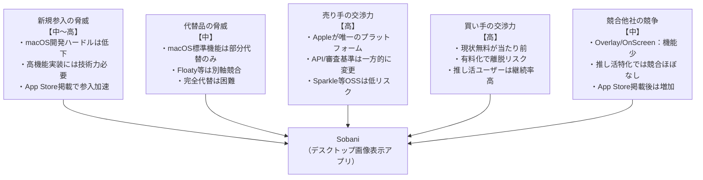

---

## 5. STP分析（Segmentation / Targeting / Positioning）

### 概要

STP分析は、市場細分化（Segmentation）・ターゲット選定（Targeting）・差別化定位（Positioning）の3ステップで、どの顧客に・どのような価値を・どのように伝えるかを明確にするフレームワークです。限られたリソースを最も効果的なセグメントに集中させる判断軸となります。

### ひとことで言うと？

> **ひとことで言うと？** お客さんを「グループ分け」→「どのグループを狙うか決める」→「そのグループにどう見られたいか決める」の3ステップ。クラスで文房具を売るとき、「可愛い系が好きな子」「シンプル派の子」に分けて、狙うグループに合わせた商品を用意するイメージです。

### 現状分析

#### Segmentation（市場細分化）

| セグメント | 規模感 | 特徴 |
|-----------|--------|------|
| 推し活・アニメファン（10〜30代） | 大（国内推定数千万人規模） | 推しキャラ・声優・アイドルを常時表示したい。感情的価値が高く、熱狂度が高い |
| ペット・家族写真愛好家（30〜60代） | 大 | 愛犬・子どもの写真で癒しを求める。機能よりも「かわいい表示」を重視 |
| VTuber・配信クリエイター（20〜35代） | 中（成長中） | 配信映えするデスクトップ演出を求める。複数ウィンドウ・プリセット活用 |
| OSSエンジニア・技術者（25〜40代） | 小〜中 | コード品質・技術力に関心。コントリビューターになり得る |
| グラフィックデザイナー・クリエイター（20〜40代） | 中 | 参考画像の常時表示、作業効率ツールとしての利用 |
| ビジネスユーザー（30〜50代） | 大（汎用化後） | 資料・数値・チェックリストを最前面表示して作業効率向上 |

#### Targeting（ターゲット選定）

**現状（デスクトップアクスタ）のメインターゲット:**
- **Primary**: 推し活・アニメファン（佐藤 凛・橘 さくら ペルソナ）— 熱狂度が高く、SNSで口コミ拡散しやすい。感情的ベネフィットが明確
- **Secondary**: ペット・家族写真愛好家（田中 幸子 ペルソナ）— 利用動機がシンプルで継続率が高い
- **Tertiary**: VTuber・配信クリエイター（水瀬 あおい ペルソナ）— 影響力があり、コミュニティへのリーチ力が高い

#### Positioning（差別化ポジショニング）

| 軸 | Sobaniの位置づけ |
|----|-----------------|
| 機能軸 | 競合と比較して最高水準の機能（背景除去・クロップ・管理パネル・3フェーズ復元） |
| 価格軸 | 完全無料・OSSで最強の価格競争力 |
| 感情軸 | 「推しを、そばに」という感情的価値を持つ唯一のアプリ |
| 技術軸 | Swift 6/Cocoa純正・Apple Silicon最適化・最新macOSへの追従 |

**ポジショニングステートメント（現状）:**
> 「推し活・ファンを愛するmacOSユーザーにとって、Sobaniは推しの画像をデスクトップに美しく常時表示できる唯一のアプリです。完全無料・OSSでありながら、背景除去・高品質クロップ・レイアウトプリセットを備えた高機能を提供します。」

### 汎用アプリ化した場合の変化・提案

#### ターゲット拡大の方向性

| 現状ターゲット | 汎用化後に追加するセグメント | アプローチ |
|--------------|---------------------------|----------|
| 推し活ファン | ビジネスユーザー（参考資料表示） | 「作業効率UP」訴求。App Storeでのキーワード「productivity」 |
| ペット写真愛好家 | デザイナー・クリエイター（参考画像表示） | 「ワークフロー改善」訴求。ProductHunt・Dribbble等でリーチ |
| VTuber配信者 | 教育者・学習者（資料表示） | 「学習補助ツール」訴求。英語圏のMacユーザーフォーラムでリーチ |

**汎用化後のポジショニングステートメント:**
> 「あらゆるmacOSユーザーにとって、Sobaniは任意の画像・写真・資料を最前面に美しく常時表示できる最高のユーティリティです。無料プランで基本機能を、Pro（$4.99）で背景除去・レイアウトプリセット等の高機能を提供します。」

### ダイアグラム

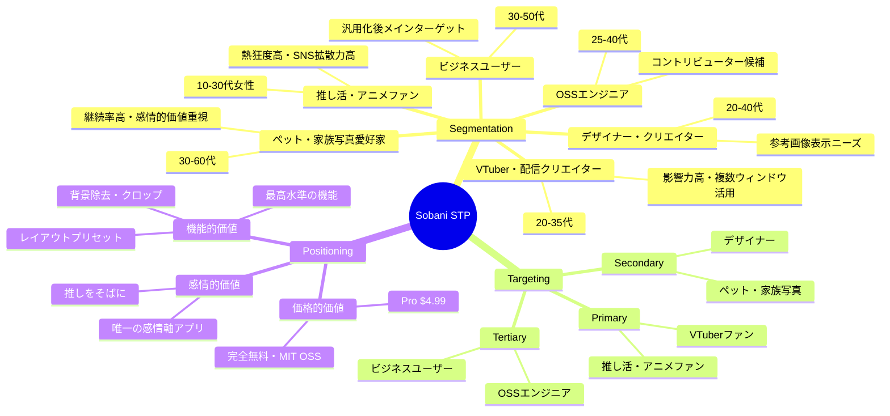

---

## 6. 4P分析（Marketing Mix）

### 概要

4P分析は、Product（製品）・Price（価格）・Place（流通）・Promotion（プロモーション）の4要素でマーケティングミックスを整理するフレームワークです。それぞれの要素が互いに整合するよう設計することが重要です。

### ひとことで言うと？

> **ひとことで言うと？** 「何を売る？いくらで？どこで？どう知ってもらう？」の4つを決めるフレームワーク。お祭りの屋台を出すとき、「たこ焼き（Product）を300円（Price）で校門前（Place）に出して、チラシを配る（Promotion）」と計画するのと同じです。

### 現状分析

| 4P要素 | 現状の内容 |
|--------|-----------|
| **Product（製品）** | ・macOS 14.0+向けデスクトップアクスタアプリ ・透過フローティングウィンドウ・最前面表示 ・Vision背景除去・iPhone風クロップエディタ ・レイアウトプリセット・管理パネル（SwiftUI） ・3フェーズ画面復元・ホットキー対応 ・ユニバーサルバイナリ（arm64+x86_64） ・DMGサイズ約7.2MB（軽量） ・対応形式: PNG/JPEG/GIF/TIFF/HEIC |
| **Price（価格）** | ・完全無料 ・MIT OSSライセンス ・収益モデルなし |
| **Place（流通）** | ・GitHub Releases（主要配布） ・Homebrew tap（`shiroemons/tap/sobani`） ・App Store未掲載 ・公式サイト（[シロ.jp/sobani](https://xn--xckxf.jp/sobani/)）からダウンロード |
| **Promotion（プロモーション）** | ・ハッシュタグ: #SobaniApp, #デスクトップアクスタ ・X（Twitter）での発信 ・GitHub READMEによる機能説明 ・Discord（VTuber・推し活コミュニティ） ・口コミ・SNSシェアによるオーガニック拡散 |

### 汎用アプリ化した場合の変化・提案

| 4P要素 | 現状 | 汎用アプリ化後 |
|--------|------|--------------|
| **Product** | 推し活特化UI・日本語のみ | 汎用UI・英語対応追加。無料プランと有料Proプランを機能で分離。アイコン・スクリーンショット等のApp Store向けアセット整備 |
| **Price** | 完全無料 | フリーミアム：無料（画像3枚・基本操作）+ Pro買い切り $4.99（画像無制限・レイアウトプリセット・背景除去・回転・管理パネル） |
| **Place** | GitHub + Homebrew | App Store掲載を最優先。GitHubとHomebrew配布も継続。App Store以外の直販チャネル（公式サイトからのDMG）も維持 |
| **Promotion** | 日本語SNSのみ | 英語SNS（X・Reddit r/macapps）展開。ProductHunt掲載。App Store ASO（キーワード最適化・レビュー獲得）。YouTubeデモ動画制作 |

---

## 7. 4C分析（顧客視点）

### 概要

4C分析は、4Pの企業視点を顧客視点に置き換えたフレームワークです。Customer Value（顧客価値）・Customer Cost（顧客コスト）・Convenience（利便性）・Communication（コミュニケーション）の4要素で、顧客が実際にどう体験するかを分析します。4Pと合わせて分析することで、マーケティング戦略の齟齬を発見できます。

### ひとことで言うと？

> **ひとことで言うと？** 4Pを「お客さん目線」でひっくり返したフレームワーク。売る側の「何を売る？」ではなく、買う側の「何がうれしい？いくらなら払える？手に入れやすい？ちゃんと情報もらえる？」で考えます。

### 現状分析

| 4C要素 | 顧客視点での評価 |
|--------|----------------|
| **Customer Value（顧客価値）** | ・推しキャラ・愛犬・家族の写真を常時そばに置ける感情的価値が最大の訴求 ・Vision背景除去でわずかなステップで「アクスタ風」表示が実現 ・複数ウィンドウ・レイアウトプリセットで「推しの空間」を作れる ・透過・回転・不透明度調整でデスクトップの邪魔にならない配置が可能 ・GIF対応でアニメーションする推しを表示できる |
| **Customer Cost（顧客コスト）** | ・金銭的コスト: ゼロ（完全無料） ・時間的コスト: 初回設定に5〜10分程度（ドラッグ＆ドロップで簡単） ・学習コスト: 直感的なUI。ただし管理パネルやクロップ機能は若干学習が必要 ・信頼コスト: 個人開発・新しいアプリへの不安。App Store未掲載でGatekeeperによる警告 |
| **Convenience（利便性）** | ・Homebrew対応で技術者はワンコマンドでインストール可能 ・GitHub Releasesから直接DMGダウンロード ・自動アップデート（Sparkle）で常に最新版を維持 ・ホットキー（Option+H/G/M）でクイックアクセス可能 ・ドラッグ＆ドロップで画像追加が直感的 ・App Store未掲載のため「見つけやすさ」は低い |
| **Communication（コミュニケーション）** | ・X（Twitter）での双方向コミュニケーション ・GitHub Issuesでバグ報告・機能要望が可能 ・Discordコミュニティでユーザー同士の交流 ・ハッシュタグ（#SobaniApp, #デスクトップアクスタ）での検索・発見 ・ただし非日本語圏とのコミュニケーションチャネルが欠如 |

### 汎用アプリ化した場合の変化・提案

| 4C要素 | 現状の課題 | 汎用化後の改善施策 |
|--------|-----------|-----------------|
| Customer Value | 推し活以外のユーザーへの価値訴求が弱い | 「作業効率UP」「デスクトップ整理」という機能的価値を前面に。ユースケース別ランディングページの整備 |
| Customer Cost | App Store未掲載でGatekeeperの警告が障壁 | App Store掲載で信頼コストを劇的に低減。Pro $4.99という明確な価格設定で「価値の証明」 |
| Convenience | 発見可能性が低い（GitHub・Homebrew依存） | App Store掲載で発見可能性を最大化。インストール手順の簡略化（Gatekeeperバイパス不要） |
| Communication | 日本語圏のみ | 英語READMEの充実、英語X/Reddit対応。ProductHuntでの英語圏への訴求 |

---

## 8. ポジショニングマップ

### 概要

ポジショニングマップは、競合他社との相対的なポジションを2軸のマップ上に可視化するフレームワークです。自社が市場でどのような位置づけにあり、差別化の余地がどこにあるかを視覚的に把握できます。空白領域（ニッチ）の発見にも役立ちます。

### ひとことで言うと？

> **ひとことで言うと？** ライバルと自分を「2つの軸の地図」に並べて、空いてるポジションを見つけるフレームワーク。飲み物の地図で「甘い↔さっぱり」「安い↔高い」の2軸に各商品を置くと、まだ誰もいない空白地帯が見えてきます。

### 現状分析

**軸の設定:**
- X軸: シンプル ←→ 高機能（機能の豊富さ）
- Y軸: ユーティリティ ←→ エンタメ（用途のトーン）

| アプリ | X軸（機能） | Y軸（トーン） | 特徴 |
|--------|------------|--------------|------|
| Sobani | 高機能 | エンタメ寄り | 推し活特化・高機能・無料OSS |
| Overlay - Screen Tracing | シンプル寄り | ユーティリティ/エンタメ中間 | 基本機能のみ・UIが古い |
| OnScreen (PiP) | シンプル〜中程度 | ユーティリティ | 画面キャプチャ特化・有料 |
| Floaty | 中程度 | ユーティリティ | ウィンドウ最前面固定・汎用 |
| Hover | 中程度〜高機能 | ユーティリティ | リアルタイム複製・特殊用途 |
| KeepTop | シンプル | ユーティリティ | 最もシンプル・機能最小 |

**分析:**
- Sobaniは「高機能×エンタメ」の象限に単独で位置し、この領域に競合がいない
- 競合の多くは「ユーティリティ」側に集中しており、エンタメ×高機能の空白地帯を独占
- 汎用化後は「高機能×ユーティリティ」方向へのポジション移動が求められる

### 汎用アプリ化した場合のポジション移動

汎用化後は「高機能×ユーティリティ」象限への移動が目標です。エンタメ訴求を残しながらも、「作業効率・実用性」の軸を強化することで、競合他社（ユーティリティ寄り）との競争で優位に立てます。

### ダイアグラム

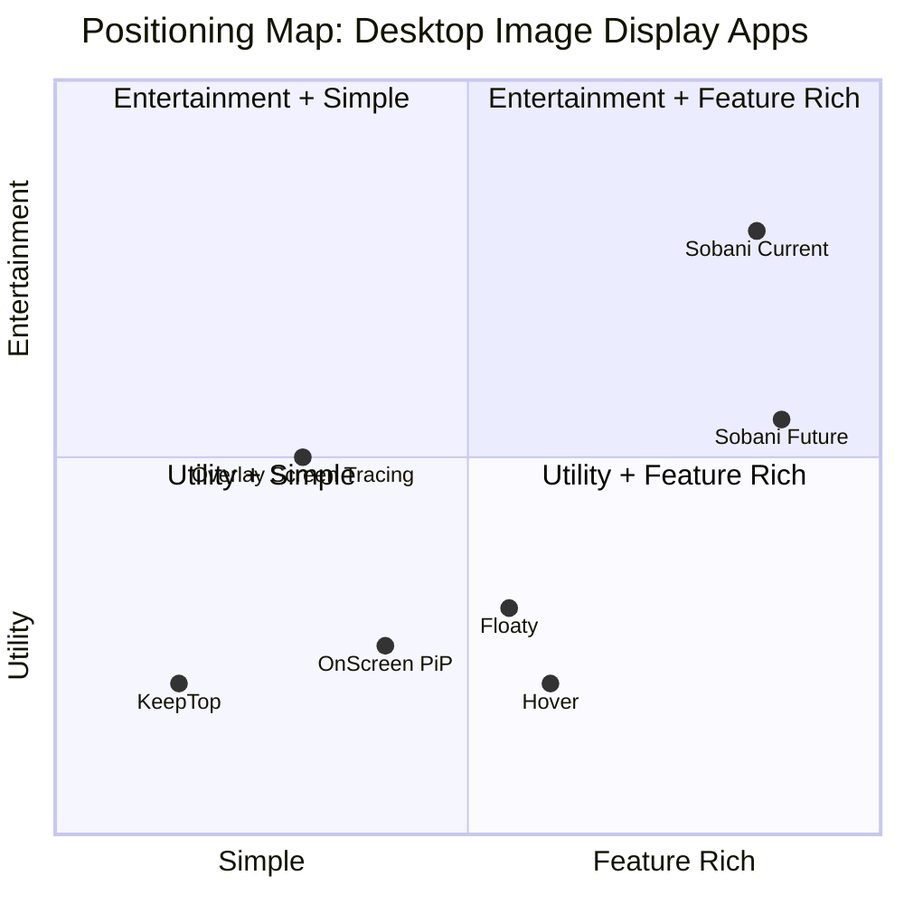

---

## 9. ブルーオーシャン戦略

### 概要

ブルーオーシャン戦略は、既存の競争の激しい「レッドオーシャン」から脱却し、競争のない新しい市場空間（ブルーオーシャン）を創造するフレームワークです。「排除・削減・増加・創造」の4アクションと「戦略キャンバス」で、価値革新のポイントを明確化します。

### ひとことで言うと？

> **ひとことで言うと？** ライバルとの血みどろの戦い（赤い海）を避けて、誰もいない新しい市場（青い海）を作り出す戦略。みんなが「もっと速く走れる靴」で競争しているところに、「歩くのが楽しくなる靴」という新ジャンルを作るようなイメージです。

### 4アクションフレームワーク

| アクション | 対象要素 | 理由 |
|-----------|---------|------|
| **排除（Eliminate）** | 複雑な設定画面・マニュアル設定が必要なウィンドウ管理 | ドラッグ＆ドロップ直感操作とプリセット自動復元で代替可能 |
| **排除** | 高価格・サブスクリプションモデル | 無料+買い切りで競合より圧倒的なコストパフォーマンスを実現 |
| **削減（Reduce）** | アプリ自体の存在感（Dock非表示、メニューバーのみ） | 「推しを引き立てる」ツールとして、アプリのUIは最小限に |
| **削減** | 初期設定の複雑さ | ドラッグ&ドロップ1操作で即使用開始できる設計を維持 |
| **増加（Raise）** | 画像編集の深度（クロップ・回転・背景除去） | 競合アプリにない本格的な画像編集機能で差別化 |
| **増加** | マルチモニター・マルチウィンドウ対応の堅牢さ | 3フェーズ画面復元でプロユーザーの信頼を獲得 |
| **増加** | レイアウト管理のUX | プリセット保存/復元で「推しの部屋」設定を再現可能に |
| **創造（Create）** | 「デスクトップアクスタ」という新ジャンル | 競合が追従できない感情的価値を持つ独自カテゴリの創造 |
| **創造** | Vision AIによる背景除去（ワンクリック） | 専門知識不要でアクスタ風切り抜きを自動化 |
| **創造** | iPhone風クロップエディタ（傾き・パース補正・非破壊） | スマートフォンUXをmacOSデスクトップアプリに移植した革新的体験 |

### 戦略キャンバス

競合との機能比較（スコア: 0〜5）

| 機能・要素 | Sobani | Overlay | OnScreen | Floaty | Hover | KeepTop |
|-----------|--------|---------|----------|--------|-------|---------|
| 無料で使える | 5 | 5 | 2 | 4 | 3 | 5 |
| 基本的な最前面表示 | 5 | 5 | 5 | 5 | 5 | 5 |
| 複数ウィンドウ表示 | 5 | 3 | 3 | 3 | 4 | 1 |
| 透明度・不透明度調整 | 5 | 3 | 3 | 2 | 2 | 1 |
| 画像回転・反転 | 5 | 1 | 1 | 0 | 0 | 0 |
| 背景除去（AI） | 5 | 0 | 0 | 0 | 0 | 0 |
| クロップエディタ | 5 | 0 | 0 | 0 | 0 | 0 |
| レイアウトプリセット | 5 | 0 | 0 | 0 | 0 | 0 |
| 管理パネル（一覧） | 5 | 0 | 1 | 2 | 2 | 0 |
| マルチモニター復元 | 5 | 1 | 1 | 2 | 2 | 1 |
| 自動アップデート | 5 | 3 | 5 | 5 | 5 | 1 |
| OSS・オープンソース | 5 | 0 | 0 | 0 | 0 | 0 |

**戦略キャンバス分析:**
Sobaniは「背景除去・クロップ・レイアウトプリセット・OSS・管理パネル」という5つの要素で競合に圧倒的差をつけています。基本機能（最前面表示・透明度）は全競合と同等以上を維持しながら、上位レイヤーの機能で市場を独自に定義しています。

### 汎用アプリ化した場合の変化・提案

汎用化においても「4アクション」の方向性は変わりません。追加で考慮すべき点は以下です。

| 汎用化での新たな創造要素 | 内容 |
|------------------------|------|
| ユースケース別テンプレート | 推し活・ビジネス資料・デザイン参考など用途別のプリセット提供 |
| プレミアム機能の可視化 | 無料ユーザーにPro機能の「プレビュー」を見せてアップグレードを促進 |
| App Store上での独自カテゴリ | 「Lifestyle」と「Productivity」の両方でリーチできるカテゴリ戦略 |
| コミュニティ共有機能 | レイアウトプリセットをコミュニティで共有・発見できるエコシステム構築 |

---

## 10. ビジネスモデルキャンバス

### 概要

ビジネスモデルキャンバス（BMC）は、Osterwalder & Pigneurが提唱した9要素でビジネスモデルを可視化するフレームワークです。企業・製品がどのように価値を創造し、提供し、収益を得るかを一枚の図に整理します。スタートアップから大企業まで広く使われており、製品の方向性転換（ピボット）時の変化点を明確にするのにも有効です。

### ひとことで言うと？

> **ひとことで言うと？** 「この商売はどうやって成り立ってるの？」を1枚の紙に9つのマスで整理するフレームワーク。「誰に？何を？どうやって届けて？お金はどこから？」をひと目で見渡せる設計図です。

### 現状分析（デスクトップアクスタアプリとして）

| 要素 | 内容 |
|------|------|
| **Key Partners（主要パートナー）** | GitHub（コード管理・配布）、Sparkle OSSコミュニティ（自動更新）、Apple（macOSプラットフォーム）、Vision Framework提供者（Apple） |
| **Key Activities（主要活動）** | Swift/Cocoa開発・バグ修正、GitHub Releasesでのリリース管理、コミュニティサポート（Issues/PR対応）、ドキュメント整備 |
| **Value Propositions（価値提案）** | 推しキャラクターを作業中も常にそばに置ける体験、透過背景・最前面表示による没入感、Vision背景除去によるワンクリック設置、ゴーストモードによる邪魔しない共存 |
| **Customer Relationships（顧客関係）** | OSSコミュニティ型（GitHubスター・Issues）、セルフサービス（ドキュメント・README）、SNSでの非公式コミュニティ |
| **Channels（チャネル）** | GitHub Releases（直接DL）、Homebrew Cask（brew install）、X/Twitter・Mastodon（告知）、個人ブログ・Zenn（技術記事） |
| **Customer Segments（顧客セグメント）** | アニメ・VTuberファン（20代女性中心）、ペット・家族写真を大切にするユーザー、OSSに親しみのあるエンジニア層 |
| **Key Resources（主要リソース）** | 開発者の技術スキル（Swift/Cocoa）、GitHubリポジトリ・ブランド、OSS貢献者コミュニティ |
| **Cost Structure（コスト構造）** | 開発者の時間コスト（無給）、Apple Developer Program（$99/年）、サーバーコストなし（GitHub無料枠） |
| **Revenue Streams（収益の流れ）** | 現状ゼロ（完全無料・MIT）、GitHubスポンサー（潜在的）、Ko-fi等の任意寄付（未実施） |

### 汎用アプリ化した場合の変化・提案

- **Key Partners**: App Store審査プロセス（Apple）が主要パートナーに加わる。Appleの審査ガイドライン準拠が必須となる
- **Key Activities**: StoreKit 2実装・IAP管理、App Store Connectでのメタデータ管理、レビュー返信対応が新たな主要活動となる
- **Value Propositions**: 「推し」特化から「どんな画像でも最前面に常時表示できる」汎用価値に拡張。参照画像・トレース用途・ToDo可視化など多様なジョブに対応
- **Customer Relationships**: App Storeレビュー機能でのサポート対応、Pro版ユーザー向けの優先サポートチャネル設置
- **Channels**: App Store（メイン）への集約。App Storeの検索・ランキングによる自然流入が主チャネルとなる
- **Customer Segments**: ニッチファン層に加え、デジタルアーティスト・デザイナー・リモートワーカー・教育者など幅広いセグメントへ拡大
- **Key Resources**: App Store最適化（ASO）ノウハウ、フリーミアム転換率分析能力が重要リソースに
- **Cost Structure**: StoreKitサーバー検証コスト（軽微）、App Store手数料（30%/15%）が発生。マーケティングコストが増加
- **Revenue Streams**: フリーミアム（Free + Pro $4.99）へ転換。定期的な収益確保が可能になる

---

## 11. リーンキャンバス

### 概要

リーンキャンバスは、Ash Mauryaがスタートアップ向けにBMCを改変したフレームワークです。「問題」と「解決策」を中心に据え、仮説検証のサイクルを高速に回すことを重視します。製品がまだ市場にフィットしていない段階や、新しい方向性を模索する際に特に有効です。

### ひとことで言うと？

> **ひとことで言うと？** ビジネスモデルキャンバスの「スタートアップ版」。「お客さんの困りごとは何？」「それをどう解決する？」からスタートして、まず小さく試して改善していくための設計図です。

### 現状分析（デスクトップアクスタアプリとして）

| 要素 | 内容 |
|------|------|
| **Problem（問題）** | ①推しキャラ画像を作業中も見たいが通常のアプリでは隠れる、②アクスタのような「置いておく」体験がデジタルにない、③既存ツールは機能が少ないかUIが複雑 |
| **Solution（解決策）** | 透過・最前面フローティングウィンドウで画像を常時表示、Vision背景除去でアクスタ風に切り抜き、シンプルな右クリックメニューで操作 |
| **Key Metrics（主要指標）** | GitHubスター数、リリースのダウンロード数、GitHub Issuesへのエンゲージメント数 |
| **Unique Value Proposition（独自の価値提案）** | 「推しを、そばに。」— アクスタをデジタル化するという明確なコンセプトと、Vision背景除去のワンクリック体験 |
| **Unfair Advantage（参入障壁）** | 推し活コミュニティへの深い理解、MIT OSSによるコミュニティ信頼、Swift 6/Cocoa専門知識 |
| **Channels（チャネル）** | X/Twitter（推し活・アニメクラスタ）、GitHub（技術者）、Homebrew Cask、個人ブログ |
| **Customer Segments（顧客セグメント）** | アーリーアダプター：アニメ・VTuberファンのmacOSユーザー（推し活に積極的な20〜30代） |
| **Cost Structure（コスト構造）** | 開発者工数（機会コスト）、Apple Developer Program $99/年 |
| **Revenue Streams（収益の流れ）** | 現状なし。将来的にはGitHubスポンサー |

### 汎用アプリ化した場合の変化・提案

- **Problem**: ①「特定の画像・図・参照素材を作業中に常に見ておきたい」②「ウィンドウが重なって必要な画像が埋もれる」③「PiPは動画専用で静止画には使えない」へ変化。より広い課題に対応
- **Solution**: 汎用画像フローティング表示に加え、クロップ・回転・不透明度調整など「参照・鑑賞・作業補助」全般をカバー
- **Key Metrics**: App Storeダウンロード数・評価数・レーティング、Free→Pro転換率（目標3〜5%）、Day7/Day30リテンション率が中心指標に
- **Unique Value Proposition**: 「どんな画像でも、常に目の前に。参照・推し活・思い出を、作業の傍らに。」— 汎用性とパーソナル感の両立
- **Unfair Advantage**: App Store初期レビュー獲得の速度（OSSからの既存ユーザー移行）、Visionフレームワーク活用による差別化機能
- **Channels**: App Storeメインに移行。ASO（App Store Optimization）が最重要チャネル施策に
- **Customer Segments**: アーリーアダプターをファン層からデジタルアーティスト・デザイナー・コンテンツクリエイターにも拡大
- **Revenue Streams**: フリーミアム（Pro $4.99）でApp Store経由の持続的収益を確立

---

## 12. バリューチェーン分析

### 概要

バリューチェーン分析は、Michael Porterが提唱した、製品・サービスが顧客に価値を届けるまでの一連の活動を「主活動」と「支援活動」に分解するフレームワークです。どのステップで付加価値が生まれ、どこにコスト・ボトルネックがあるかを可視化します。

### ひとことで言うと？

> **ひとことで言うと？** 商品がお客さんに届くまでの「工程」を一つずつ見て、「どこで価値が生まれてる？どこがムダ？」を見つけるフレームワーク。パン屋さんで「小麦の仕入れ→パン作り→陳列→接客→販売」の各段階をチェックするイメージです。

### 現状分析（デスクトップアクスタアプリとして）

**主活動（Primary Activities）:**

- **開発（Inbound Logistics）**: Swift 6/Cocoa実装、Vision背景除去統合、Sparkle自動更新、GitHub管理
- **配布（Operations）**: GitHub Releasesへのバイナリ公開、Homebrew Caskのフォーミュラ更新、appcast.xml生成
- **オンボーディング（Outbound Logistics）**: README/ドキュメントサイト、初回起動時のデフォルト画像表示
- **日常利用（Marketing & Sales）**: 機能発見（右クリックメニュー）、自動アップデート通知（Sparkle）
- **コミュニティ（Service）**: GitHub Issues対応、Pull Request review、SNSでのフィードバック収集

**支援活動（Support Activities）:**
- Apple Developer Program（インフラ）
- Sparkle OSSフレームワーク（技術基盤）
- SwiftLint・CIによるコード品質管理

### 汎用アプリ化した場合の変化・提案

- **開発**: App Sandboxへの対応、StoreKit 2統合、Sparkle削除（App Store自動更新への移行）が必要。コード署名・Entitlements設定の見直し
- **配布**: GitHub Releases廃止→App Store Connect経由の配布一元化。審査プロセス（通常1〜3日）がリードタイムに加わる
- **オンボーディング**: デフォルト画像を削除し、初回起動時に画像選択を促すウィザード形式のオンボーディングを実装。機能説明ツールチップの追加
- **日常利用**: App Store内アップデート通知、Pro機能のペイウォール表示、ストア評価の適切なタイミングでの要求（`SKStoreReviewController`）
- **コミュニティ**: App Storeレビューへの返信対応が追加。GitHub IssuesはOSSコミュニティ向けに継続

### ダイアグラム

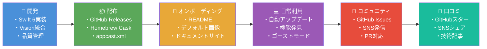

---

## 13. ジョブ理論（JTBD）

### 概要

ジョブ理論（Jobs-To-Be-Done）は、Clayton Christensenが提唱した、ユーザーが製品を「雇用する」際の根本的な動機（ジョブ）を理解するフレームワークです。「機能的ジョブ」（実際に達成したいこと）、「情緒的ジョブ」（感じたいこと）、「社会的ジョブ」（他者に見せたい自分）の3層で分析します。

### ひとことで言うと？

> **ひとことで言うと？** 「お客さんはドリルが欲しいんじゃない、穴が欲しいんだ」という考え方。人が商品を買うのは「やりたいこと（ジョブ）」があるから。そのジョブを理解すれば、本当に必要な商品が見えてきます。

### 現状分析（デスクトップアクスタアプリとして）

**機能的ジョブ（Functional Jobs）:**
- 推しキャラクターの画像をPC作業中も常に視界に入れておきたい
- 切り抜き処理なしにアクスタ風の立体感を手軽に作り出したい
- 複数の推しを同時に、好きな配置でデスクトップに並べたい
- 作業の邪魔にならない形（ゴーストモード）で画像を表示したい
- アプリを終了・再起動しても配置が保存されていてほしい

**情緒的ジョブ（Emotional Jobs）:**
- 推しが「そばにいる」感覚を得て、孤独感・疲労感を和らげたい
- 好きなコンテンツに囲まれた「自分だけの空間」を作りたい
- 推しを大切にしている自分を実感して、日常の幸福感を高めたい
- 仕事・勉強中のモチベーション維持に推しの存在を活用したい
- デジタルとリアルの境界を曖昧にする新しい体験を楽しみたい

**社会的ジョブ（Social Jobs）:**
- デスクトップのスクリーンショットをSNSでシェアして「推し活している自分」を表現したい
- 同じ推しを持つコミュニティで「こんな使い方ができる」と発信したい
- OSSへの貢献・PRを通じて技術コミュニティでの存在感を示したい

### 汎用アプリ化した場合の変化・提案

ジョブの軸を「推し活」から「常に見ておきたい情報・画像の管理」へ拡大します。

**拡大する機能的ジョブ:**
- デジタルアーティストが参照画像を描画ツールの隣に常時表示したい
- リモートワーカーがToDo・メモを付箋代わりに最前面表示したい
- 写真家・デザイナーが比較参照用の画像を並べて作業したい
- 教育者が講義資料の一部を常時表示しながら作業したい

**拡大する情緒的ジョブ:**
- 家族・ペットの写真を常に見えるところに置いて安心感を得たい
- 大切な思い出をデジタルフォトフレームとしてデスクトップに置きたい

### ダイアグラム

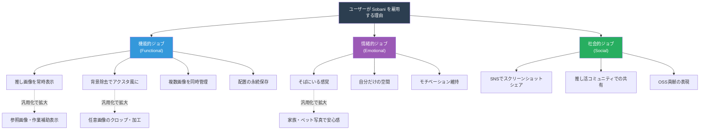

---

## 14. カスタマージャーニーマップ

### 概要

カスタマージャーニーマップは、ユーザーが製品を知ってから熱狂的な推奨者になるまでの一連の体験を可視化するフレームワークです。各ステージでのユーザー行動・感情・タッチポイント・ペインポイントを整理することで、UX改善の優先箇所を特定できます。

### ひとことで言うと？

> **ひとことで言うと？** お客さんが「知る→気になる→買う→使う→人に勧める」までの体験を、物語のように時系列で描くフレームワーク。映画を観に行くときの「予告編を見る→上映時間を調べる→チケットを買う→映画を観る→友達に感想を話す」のような流れを整理します。

### 現状分析（デスクトップアクスタアプリとして）

| ステージ | ユーザー行動 | 感情 | タッチポイント | ペインポイント |
|---------|------------|------|--------------|--------------|
| **認知** | 推し活アカウントのTLでスクリーンショットを見る、「macOS 推しデスクトップ」で検索 | 興味・好奇心 | X/Twitter、GitHub検索 | 「デスクトップアクスタ」という言葉を知らない |
| **検討** | GitHubリポジトリのREADMEを読む、スクリーンショットを確認 | 期待・不安 | GitHubリポジトリ、ドキュメントサイト | macOSの「未確認の開発元」警告で躊躇 |
| **導入** | GitHubからDL、右クリックで開く、デフォルト画像が表示される | 驚き・達成感 | GitHub Releases、Gatekeeper警告 | 「これじゃない画像が出てきた」戸惑い |
| **活用** | 画像をドラッグして追加、Vision背景除去を試す、ゴーストモード発見 | 楽しさ・愛着 | アプリ本体、右クリックメニュー | 機能の多さに圧倒される、何ができるか分からない |
| **推奨** | スクリーンショットをXにポスト、GitHubスター、友人に紹介 | 誇り・共有欲 | X/Twitter、GitHub | 「App Storeにない」と紹介しにくい |

### 汎用アプリ化した場合の変化・提案

- **認知**: 検索キーワードが「推し活」から「macOS 画像 最前面」「reference image app mac」などに拡大。App Storeのカテゴリ検索でも流入
- **検討**: App Storeのスクリーンショット・説明文が主な情報源に。App Storeレビュー・評価が信頼形成に直結
- **導入**: Gatekeeper問題が解消。App Storeから1タップでインストール。初回起動でオンボーディングウィザードを表示し「まず画像を選ぶ」を促す
- **活用**: Pro機能のアップセル機会を適切なタイミングで提示。無料制限（3枚）に達したときに自然なProへの誘導
- **推奨**: App Storeレビュー要求（`SKStoreReviewController`）を適切なタイミングで表示。「App Storeで見つけた」という紹介のしやすさが向上

### ダイアグラム

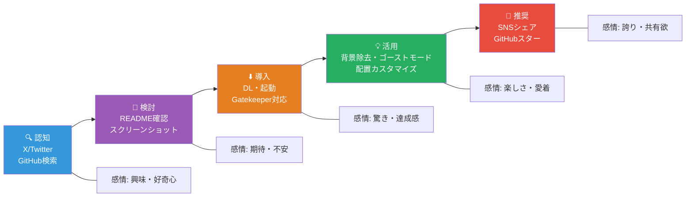

---

## 15. AARRR（海賊メトリクス）

### 概要

AARRRは、Dave McClureが提唱したグロースハックのフレームワークで、「海賊メトリクス」とも呼ばれます。Acquisition（獲得）→ Activation（活性化）→ Retention（継続）→ Referral（紹介）→ Revenue（収益）の5ファネルで製品の成長を測定・改善します。

### ひとことで言うと？

> **ひとことで言うと？** アプリの成長を「来てくれた？→使ってくれた？→また来てくれた？→友達に教えてくれた？→お金を払ってくれた？」の5段階で測るフレームワーク。じょうごのように上から下へ人が減っていくので、どこで減ってるかを見つけて改善します。

### 現状分析（デスクトップアクスタアプリとして）

| ファネル | 現状の指標・施策 | 課題 |
|--------|--------------|------|
| **Acquisition（獲得）** | GitHub検索流入、X/Twitterシェア経由、Homebrew install数 | 認知範囲がエンジニア・技術者に偏っている |
| **Activation（活性化）** | 起動→デフォルト画像表示まで（=初回価値体験）、5分以内に画像差し替え | 「自分の画像を設定する」ところまで到達するユーザーが少ない可能性 |
| **Retention（継続）** | 自動アップデート率（Sparkle）、繰り返し起動率 | ログイン時自動起動で受動的リテンションは高いが、能動的利用頻度は不明 |
| **Referral（紹介）** | GitHubスター数の推移、X/Twitterでの言及数 | 計測ツールが不足（Analytics未導入） |
| **Revenue（収益）** | 現状ゼロ | 収益化モデルが存在しない |

### 汎用アプリ化した場合の変化・提案

- **Acquisition**: App Store検索（ASO）がメイン獲得チャネルに。キーワード最適化（「floating image」「always on top」「overlay image mac」）が重要。SNS広告・コンテンツマーケティングの強化
- **Activation**: 初回起動時のオンボーディング完了率（目標80%以上）、「最初の画像を表示する」までの所要時間（目標2分以内）を主要指標に
- **Retention**: Day1/Day7/Day30リテンション率を計測（目標: Day7 40%以上）。ログイン時自動起動による受動的リテンションを継続活用
- **Referral**: App Storeレビュー率（目標: 使用7日後に要求）、「友達に勧めたいか？」NPS計測。ソーシャルシェアボタン（スクリーンショット共有）の追加
- **Revenue**: Free→Pro転換率（目標3〜5%）、LTV（Life Time Value）計測。無料ユーザーが「3枚制限」に達したタイミングでのProアップセル率を最重要KPIに

### ダイアグラム

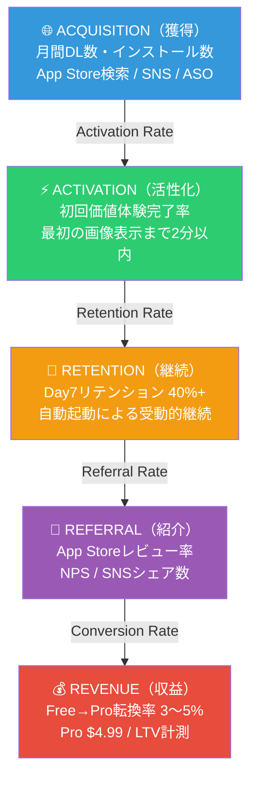

---

## 16. プロダクトライフサイクル

### 概要

プロダクトライフサイクル（PLC）は、製品が市場に投入されてから衰退するまでの「導入期→成長期→成熟期→衰退期」の4段階を示すフレームワークです。各段階で最適なマーケティング・開発戦略が異なります。

### ひとことで言うと？

> **ひとことで言うと？** 商品にも人間と同じように「生まれたて→成長→大人→老い」のステージがある、という考え方。今どのステージにいるかで、やるべきことが変わります。赤ちゃんの時期に大人のマネをしても上手くいきません。

### 現状分析（デスクトップアクスタアプリとして）

**Sobaniの現在の段階: 成長期初期**

- GitHubスター数が緩やかに増加中
- Homebrew Cask登録済みで発見可能性が向上
- コア機能（背景除去・クロップ・ゴーストモード）が安定
- SNSでの自発的なシェアが散発的に発生
- 競合が少ないニッチ市場で先行者優位を確立中
- 一方で、認知範囲はエンジニア・技術者に留まっており、ターゲットの推し活ユーザーへのリーチはまだ限定的

**成長期での課題:**
- エンジニア以外への認知拡大
- 「デスクトップアクスタ」カテゴリそのものの啓蒙
- バグ修正と機能安定化の継続

### 汎用アプリ化した場合の変化・提案

汎用アプリはApp Storeでの新規リリースとなり、**導入期からのスタート**になります。

| 段階 | Sobani（現状） | 汎用アプリ（予測） | 戦略 |
|------|-------------|----------------|------|
| **導入期** | 済（v1.0リリース時） | App Storeリリース時点 | プレスリリース、ProductHunt掲載、既存ユーザーへの移行案内 |
| **成長期** | 現在（初期） | リリース後3〜12ヶ月 | ASO最適化、機能追加、App Store評価収集、Pro機能拡充 |
| **成熟期** | 未達 | 1〜2年後 | 価格調整、新セグメント開拓（チーム向け、教育向け） |
| **衰退期** | — | 3年以上後 | macOS新機能への対応、リブランド検討 |

### ダイアグラム

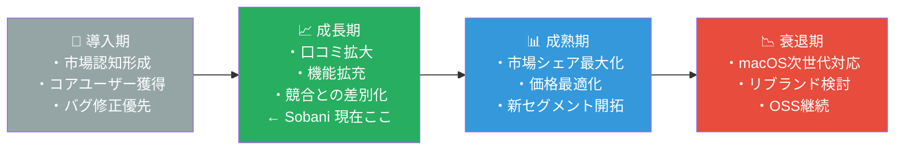

---

## 17. アンゾフのマトリクス

### 概要

アンゾフのマトリクスは、製品と市場の「既存/新規」の2軸で成長戦略を4象限に分類するフレームワークです。Igor Ansoffが提唱した古典的フレームワークですが、プロダクトの成長方向性を議論する際に今も広く使われています。

### ひとことで言うと？

> **ひとことで言うと？** 「今の商品×今の客」「今の商品×新しい客」「新しい商品×今の客」「新しい商品×新しい客」の4パターンで成長の方向を考えるフレームワーク。たこ焼き屋が「もっと売る」か「別の場所でも売る」か「焼きそばも始める」か「まったく別の商売を始める」かを選ぶイメージです。

### 現状分析（デスクトップアクスタアプリとして）

| 象限 | 戦略 | Sobaniの状況 |
|------|------|------------|
| **市場浸透**（既存製品×既存市場） | 推し活macOSユーザーへのリーチ強化 | 現在のメイン戦略。X/Twitterでの認知拡大、Homebrew Cask経由の発見性向上 |
| **市場開拓**（既存製品×新規市場） | 同一機能を異なるユーザー層へ展開 | エンジニア以外（デザイナー、一般ユーザー）への展開。英語圏ユーザーへのアプローチ |
| **製品開発**（新規製品×既存市場） | 推し活ユーザー向けの新機能 | アニメ風フィルター、コスチューム変更、推し活専用プリセット等の可能性 |
| **多角化**（新規製品×新規市場） | 全く新しいカテゴリへの展開 | 現時点では対象外。リスク最大の戦略 |

### 汎用アプリ化した場合の変化・提案

汎用アプリ化は「**市場開拓戦略**」に相当します。既存の製品技術を維持しつつ、推し活以外の新規市場（デジタルアーティスト、リモートワーカー、教育者等）へ展開します。

- **市場浸透**: App Store内でのASO最適化により、既存の「画像最前面表示」需要層への浸透を強化
- **市場開拓**: 「推し活」ブランドを廃し、汎用ツールとして英語圏を含むグローバル市場へ進出
- **製品開発**: Proプランにより「高度な編集機能」「ウィンドウグループ保存」「キーボードショートカットのカスタマイズ」などを追加
- **多角化**: 将来的に「チーム向けプレゼンオーバーレイ」などのB2B展開も検討可能

### ダイアグラム

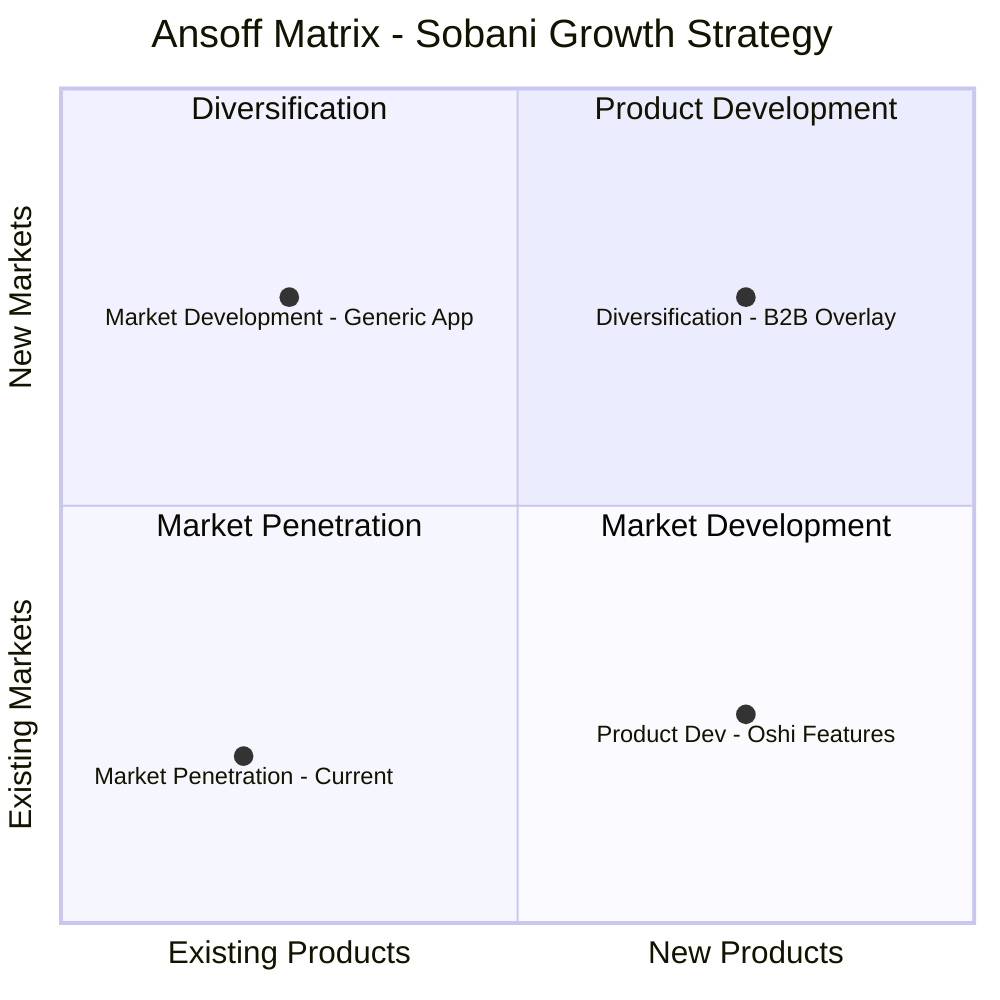

---

## 18. TAM / SAM / SOM（市場規模推定）

### 概要

TAM/SAM/SOMは、事業機会の市場規模を3層に分けて推定するフレームワークです。TAM（Total Addressable Market：全体市場）、SAM（Serviceable Addressable Market：実際にアプローチできる市場）、SOM（Serviceable Obtainable Market：現実的に獲得できる市場）の順に範囲が絞られます。投資家向け資料でも頻出します。

### ひとことで言うと？

> **ひとことで言うと？** 「全部でどれくらいの市場？→実際に届けられる範囲は？→最初に取れそうなのは？」と3段階で市場の大きさを絞っていくフレームワーク。「日本中の中学生（TAM）→うちの市の中学生（SAM）→うちの学校の生徒（SOM）」のように、現実的な目標を決めます。

### 現状分析（デスクトップアクスタアプリとして）

**前提データ（2025年時点の概算）:**
- 全世界のmacOSアクティブユーザー: 約1.2億人
- 日本国内のmacOSユーザー: 約600万人
- 「推し活」に関心のある日本の10〜40代: 約1,500万人（各種調査より）
- そのうちmacOSユーザー（約15%）: 約225万人

| 市場 | 定義 | 規模 | 根拠 |
|------|------|------|------|
| **TAM** | 全macOSユーザー（デスクトップアプリ潜在需要） | 約1.2億人 / 年間約240億円相当 | App Store平均ARPU $2/年×1.2億人 |
| **SAM** | 日本国内の推し活macOSユーザー | 約225万人 / 約4.5億円 | 225万人×$2（無料配布のため収益化想定） |
| **SOM** | 初年度GitHub経由で獲得可能なユーザー | 約1万人 | GitHub類似OSSアプリの年間DL実績から推計 |

**重要な制約**: 現状はMIT完全無料のため、実際の収益はゼロ。SOMは「影響力・認知」の指標として使用。

### 汎用アプリ化した場合の変化・提案

汎用アプリ化により、市場の定義が大きく変わります。

| 市場 | 汎用アプリでの定義 | 規模 | 根拠 |
|------|-----------------|------|------|
| **TAM** | 全世界のmacOSユーザー（ユーティリティアプリ需要） | 約1.2億人 / 年間約3,600億円 | macOS Utilities カテゴリ全体市場 |
| **SAM** | 「画像・参照素材を常時表示したい」需要層（推定macOSユーザーの5%） | 約600万人 / 約30億円 | Overlay/OnScreen系アプリの合算DL数から推計 |
| **SOM** | App Store初年度獲得目標（既存OSSユーザー+ASO流入） | 約5万人 / 約1,500万円 | 転換率3%×5万DL×$4.99（Free→Pro転換） |

**数値根拠の補足:**
- 類似アプリ「Overlay - Screen Tracing」「OnScreen (PiP)」はApp Store Productivity/Utilitiesで一定の評価を獲得
- macOSユーティリティアプリの平均価格帯は$2.99〜$9.99（フリーミアム含む）
- 初年度5万DLはApp Store中規模ユーティリティアプリの現実的な水準

### ダイアグラム

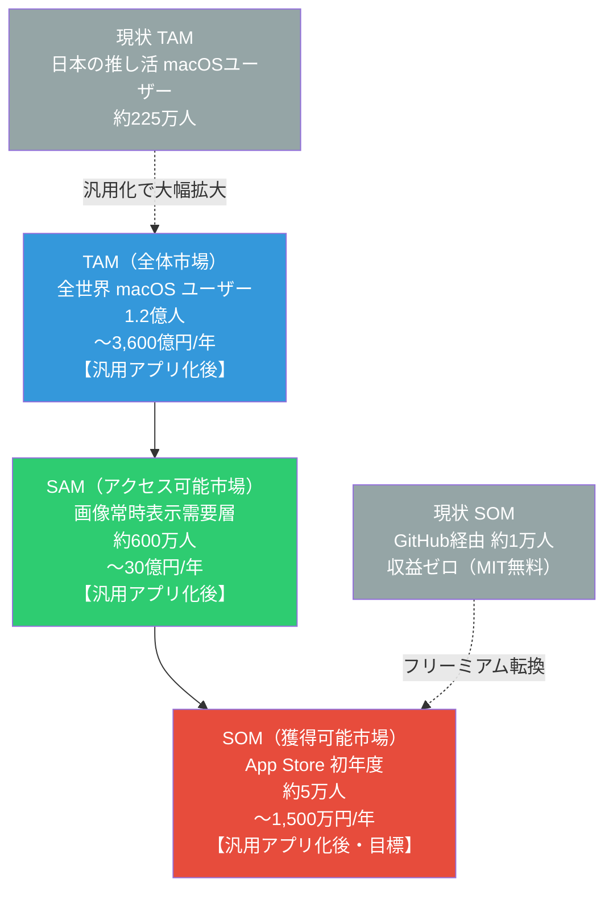

---

## 付録A: 汎用アプリ化で変えるべきポイントまとめ

### ブランディング・メッセージング

#### アプリ名候補（20案）

日本語でも英語圏でも通じる、キャッチーで覚えやすいアプリ名の候補です。「画像を最前面に常時表示する」という機能を直感的に伝えるものを中心に選定しました。

| # | アプリ名 | キャッチコピー（日本語） | キャッチコピー（英語） | 評価 | 評価理由 |
|---|---------|---------------------|---------------------|------|---------|
| 1 | **Pinboard** | 好きな画像を、目の前に。 | Pin your favorites. Always visible. | 82/100 | 「ピンで留める」イメージが直感的。ただし既存のブックマークサービス「Pinboard」と名前が被る |
| 2 | **Floaty** | ふわっと浮かぶ、いつもそこに。 | Float any image. Always on top. | 68/100 | 浮遊感がある可愛い名前だが、同名の既存macOSアプリ（ウィンドウ最前面固定）が存在し競合する |
| 3 | **PinUp** | 壁に貼るように、デスクトップに。 | Pin up anything on your desktop. | 75/100 | 短く覚えやすい。ただし英語圏では「ピンナップ」の連想がありやや注意 |
| 4 | **Overlay** | 重ねて飾る、あなたのデスクトップ。 | Overlay images on your desktop. | 60/100 | 機能を直接表すが、同名の既存アプリ「Overlay - Screen Tracing」と完全に被る |
| 5 | **Deskdrop** | デスクトップに、ドロップするだけ。 | Drop images on your desktop. | 78/100 | 「デスクトップ」+「ドロップ」の造語。動作を示す名前で、操作感が伝わる |
| 6 | **Pinne** | 留めておきたい、この一枚。 | Pin it. See it. Love it. | 83/100 | 短く国際的。「Pin」+フィンランド語の響き。App Storeで目立つ4文字 |
| 7 | **Kabekami** | 壁紙の上の、もうひとつの世界。 | Beyond wallpaper. Your floating gallery. | 72/100 | 「壁紙」のローマ字。日本語話者には直感的だが、英語圏では意味が伝わりにくい |
| 8 | **Toppin** | いちばん上に、いちばん好きを。 | Keep your favorites on top. | 85/100 | 「Top」+「Pin」の造語。短く覚えやすく、機能（最前面+固定）を端的に表す。App Storeで検索しやすい |
| 9 | **Stickie** | ペタッと貼る、お気に入り。 | Stick your images anywhere. | 70/100 | 付箋のイメージで親しみやすいが、macOS標準の「Stickies」と紛らわしい |
| 10 | **Framey** | フレームの中の、小さな世界。 | Frame your world on desktop. | 76/100 | 写真フレームのイメージ。語感が可愛く覚えやすい。ただし機能（最前面表示）が名前から伝わりにくい |
| 11 | **Pikka** | ピッと出して、パッと飾る。 | Pick an image. Pin it. Done. | 80/100 | 短く響きがよい。「Pick」から派生した造語。グローバルに発音しやすい |
| 12 | **OnTop** | 常に最前面、常にあなたのそばに。 | Always on top. Always in sight. | 77/100 | 機能を直球で表す。シンプルだが、差別化しにくく印象に残りにくい |
| 13 | **Hovr** | ホバーする画像、浮遊する世界。 | Hover your images above everything. | 74/100 | 母音省略のモダンなスタイル。ただし既存の「Hover」アプリと類似 |
| 14 | **Peekaboo** | いないいない、ばあ！ いつもそこに。 | Peek at your favorites, always. | 71/100 | 遊び心があり覚えやすいが、アプリの本質（常時表示）と「隠れる」イメージがやや矛盾 |
| 15 | **Layover** | レイヤーを重ねて、自分だけの景色を。 | Layer your favorite images on screen. | 79/100 | 「Layer」+「Over」。デザイナーに馴染む用語。App Storeでの検索性も良い |
| 16 | **Pinnit** | ピンで留めて、いつでも見える。 | Pin it on your screen. | 86/100 | 「Pin it」のもじり。4文字台で覚えやすく発音しやすい。動詞的で行動を促す名前。App Storeでの検索性が高い |
| 17 | **Deskpet** | デスクトップの小さな相棒。 | Your tiny desktop companion. | 73/100 | ペットのような愛着を感じさせるが、汎用ツールとしてはややカジュアルすぎる可能性 |
| 18 | **Showka** | 見せたいものを、いつも目の前に。 | Show what matters. Always. | 69/100 | 「Show」+「ka」の造語。日本語の「見せる」感が入っているが、英語圏で発音に迷う可能性 |
| 19 | **Afloat** | 浮かべよう、好きな画像を。 | Keep your images afloat. | 65/100 | 英語として美しいが、同名のmacOS用ユーティリティが過去に存在した |
| 20 | **Glimpse** | ちらっと見える、大好きなもの。 | A glimpse of what you love. Always. | 81/100 | 英語として美しく意味も合う。ただし Linux の画像編集ソフト「Glimpse」と被る可能性 |

#### 90点以上の候補（追加調査）

App Store上の既存名衝突をWeb検索で確認し、90点以上の候補を追加しました。

| # | アプリ名 | キャッチコピー（日本語） | キャッチコピー（英語） | 評価 | 評価理由 |
|---|---------|---------------------|---------------------|------|---------|
| 21 | **Overpin** | 画像を最前面にピン留め。 | Pin any image above everything. | 92/100 | "over"+"pin"で機能が直感的に伝わる。6文字で覚えやすく、押しピンのアイコンが想起される。App Store検索で"pin""over"両方にヒット。同名アプリなし |
| 22 | **Pinfloat** | 画像を浮かせて、最前面に固定。 | Float your images, pinned on top. | 91/100 | "pin"+"float"で機能を二重に表現。両単語ともApp Store検索に強い。ロゴは浮遊する押しピンで視覚的に優秀。同名アプリなし |
| 23 | **Pinlay** | 画像を並べて、すべてを見渡す。 | Lay out your pins. See everything. | 90/100 | 6文字で簡潔。"pin"+"layout"の合成。複数画像レイアウト機能との親和性が高い。display/layoutの連想あり。同名アプリなし |

#### Top 5 推薦（更新版）

| 順位 | アプリ名 | 評価 | 推薦理由 |
|------|---------|------|---------|
| 1 | **Overpin** | 92/100 | "over"+"pin"で機能直感的・6文字・アイコン想起しやすい・同名アプリなし |
| 2 | **Pinfloat** | 91/100 | "pin"+"float"で検索2キーワードカバー・ロゴイメージ明快・同名アプリなし |
| 3 | **Pinlay** | 90/100 | 6文字簡潔・レイアウト機能との親和性・display/layout連想・同名アプリなし |
| 4 | **Pinnit** | 86/100 | 短い・動詞的で行動を促す・やや造語感が強い |
| 5 | **Toppin** | 85/100 | "Top"+"Pin"で機能凝縮・日本語で「トッピング」連想がやや気になる |

> **注**: App Store登録前に、各候補名のApp Store内での既存使用状況・商標登録状況を必ず確認してください。

- **アプリ名**: 「Sobani（そばに）」は汎用アプリとしても使えるが、意味が分かりにくい。英語圏向けには「Pinit」「FloatFrame」「OverlayKit」等の候補を検討
- **キャッチコピーの変更**: 「推しを、そばに。」→「どんな画像も、常に目の前に。」/ 英語: "Pin Any Image. Always On Top."
- **App Storeカテゴリの変更**: `Productivity` または `Utilities` カテゴリへ変更（現状想定は Entertainment に近い）
- **App Storeサブカテゴリ**: Graphics & Design を検討
- **スクリーンショットの刷新**: 推し活ユーザー向けのビジュアルから、参照画像・デザイン作業・写真管理などの多用途ユースケースを示す画像へ

### UI/UXの変更

- **特化表現の汎用化**: メニュー・説明文中の「推し」「アクスタ」等の表現を削除または汎用的な言葉に置き換え
- **デフォルト画像の削除**: 現在のデフォルトキャラクター画像を削除し、空の状態から始まるUIに変更（空白スクリーン+「画像を追加」ボタンの表示）
- **初回起動フローの刷新**: オンボーディングウィザード（3〜5ステップ）を実装。「画像を選ぶ→表示される→操作方法を学ぶ」の流れを保証
- **オンボーディングコンテンツ**: 使用シーン別チュートリアル（推し活・参照画像・写真表示）を用意し、ユーザーが自分のユースケースを選択できるように
- **ツールチップの追加**: 各機能（背景除去・クロップ・ゴーストモード等）に簡潔な説明ツールチップを表示
- **Proペイウォールの設計**: 無料制限（3枚）に達したときの、自然で押し付けがましくないProへの誘導UIを設計

### 技術的変更

- **App Sandbox有効化**: App Store配布必須要件。ファイルアクセス権限の見直しが必要（ユーザーが選択した画像への `NSOpenPanel` 経由アクセスに変更）
- **Sparkle削除**: App Storeの自動更新機能に移行。`SPUStandardUpdaterController` と関連コードを削除
- **Bundle ID変更**: `com.shiroemons.Sobani` → App Store用新Bundle ID（例: `com.shiroemons.FloatImage` 等）
- **コード署名変更**: Distribution証明書でのApp Store提出用署名に変更
- **StoreKit 2実装**: `Product.purchase()`、レシート検証、Proステート管理の実装
- **エンタイトルメント更新**: App Sandbox、iCloud（状態同期検討）、ネットワークアクセス制御の見直し
- **Privacy Manifest追加**: App Store要件として `PrivacyInfo.xcprivacy` の追加が必要（APIアクセスの申告）
- **App Support URL変更**: サンドボックス環境に合わせたファイル保存先の変更（`~/Library/Containers/` 以下）

### ビジネスモデル

- **MIT無料→フリーミアム**: MIT LicenseはOSS版（GitHub）として継続し、App Store版は別途フリーミアムとして展開する二本立て戦略を検討
- **StoreKit 2実装**: `Transaction`、`Product`（非定期のIAP）を使ったProアンロック実装
- **機能の無料/Pro分離**:
  - 無料: 画像3枚まで、基本表示・移動・リサイズ
  - Pro: 無制限画像、背景除去（Vision）、クロップエディタ、管理パネル、レイアウトプリセット、回転・反転・不透明度
- **ファミリー共有**: StoreKitのFamily Sharing対応でApp Store評価への好影響を期待
- **返金ポリシー**: App Store標準の返金ポリシーに委ねる（独自対応不要）

### マーケティング・配布

- **GitHub Releases → App Store**: メイン配布チャネルの完全移行。GitHub版はOSSとして継続するが、メインの宣伝はApp Storeへ
- **Homebrew → App Store検索**: Homebrew Caskのメンテナンスは継続可能だが、新規ユーザーの主要流入路はApp Storeに
- **ASO（App Store Optimization）**: タイトル・サブタイトル・キーワードの最適化。「floating image」「always on top」「overlay」「reference image」等のキーワード戦略を策定
- **ProductHunt掲載**: リリース時にProductHuntへの掲載申請。技術系ユーザーへの初期流入確保
- **SNS戦略の拡大**: 推し活クラスタに加え、デザイナー・イラストレーター・写真愛好家コミュニティへのリーチ拡大。英語圏への発信も開始
- **App Storeレビュー戦略**: 初期ユーザー（GitHub OSSユーザー）に向けてApp Storeへのレビュー依頼を行い、初期評価数を確保
- **プレスリリース**: macOS特化ブログ（MacStories等）へのメール送付によるレビュー掲載獲得

---

## 付録B: マーケティングフレームワークのMarkdownテンプレート・ツールガイド

### 利用可能なツール・テンプレート

#### 1. Mermaid.js — テキストベースのダイアグラムツール

コードとしてダイアグラムを記述でき、GitHubのMarkdownでネイティブサポートされています。バージョン管理との相性が最も良く、このドキュメントでも全面的に活用しています。

- **flowchart**: フロー図、関係図、バリューチェーン、ジョブ理論など汎用的に使用可能
- **quadrantChart**: 2軸マトリクス（アンゾフ、BCG、ポジショニングマップ等）
- **mindmap**: マインドマップ（STP発散など）
- **timeline**: 時系列（プロダクトライフサイクルの歴史等）
- **gantt**: ガントチャート（ロードマップ）
- **xychart-beta**: 棒グラフ・折れ線グラフ（AARRR数値可視化等）

プレビューは [Mermaid Live Editor](https://mermaid.live/) で確認可能。

**注意事項:**
- `quadrantChart` のラベルは英語推奨（日本語を使うとレンダリングが崩れる場合がある）
- `flowchart` のノードに日本語は使用可能だが、改行には `\n` を使用
- `mindmap` はインデントで階層を表現

#### 2. Markdownテーブル — 格子状情報の表現に最適

BMC・リーンキャンバスの9要素、AARRRの5ファネル、カスタマージャーニーマップのステージ別情報など、比較・一覧性が求められる情報の整理に最適です。ツール不要で全てのMarkdownレンダラーでサポートされています。

#### 3. GitHubテンプレートリポジトリ

Markdownベースのビジネスフレームワークテンプレートとして以下が参考になります。

- **GeorgLink/Business-Model-Canvas-MD-template**: BMCをMarkdownテーブルで表現するテンプレート
- **shermanhuman/planvas**: Lean Canvasをインタラクティブに作成するWebアプリ
- **YJPL/business-model-canvas-for-obsidian**: Obsidianプラグイン形式でBMCを管理

#### 4. 専用ライブラリの状況

マーケティングフレームワーク分析専用のnpm/pip/gemパッケージは2025年時点で実用的なものは存在しません。

- **@nguyenphp/antigravity-marketing**: AI駆動型マーケティングCLIツールが存在するが、フレームワーク構造的分析（BMC/JTBD等）には不向き
- **結論**: Mermaid.js + Markdownテーブルの組み合わせが最も実用的かつメンテナンス性の高いアプローチ

#### 5. AI補助ツール

- **Claude / ChatGPT**: フレームワークの各要素を自然言語で記述し、Markdownテーブル・Mermaid記法に変換するのに有効
- **Perplexity**: 競合調査・市場データ収集に活用可能
- **Notion AI**: Notionのデータベース機能と組み合わせたフレームワーク管理が可能

### 各フレームワークに適したMermaid種別

| フレームワーク | 推奨Mermaid種別 | 代替手段 |
|------------|--------------|--------|
| SWOT分析 | `quadrantChart` | Markdownテーブル（4象限） |
| STP分析 | `mindmap` | Markdownテーブル |
| 4P/4C分析 | `flowchart LR` | Markdownテーブル |
| ポーターの5力 | `flowchart TD` | Markdownテーブル |
| バリューチェーン | `flowchart LR` | Markdownテーブル |
| ペルソナ | `mindmap` | Markdownテーブル |
| ポジショニングマップ | `quadrantChart` | 画像（Figma等） |
| ブルーオーシャン | `xychart-beta` | 画像（Excel等） |
| バリュープロポジション | `flowchart` | Markdownテーブル |
| ビジネスモデルキャンバス | Markdownテーブル | Mermaid `block` |
| リーンキャンバス | Markdownテーブル | Mermaid `block` |
| ジョブ理論（JTBD） | `flowchart TD` | Markdownテーブル |
| カスタマージャーニーマップ | `flowchart LR` | Markdownテーブル |
| AARRR | `flowchart TD` | `xychart-beta`（数値あり） |
| プロダクトライフサイクル | `flowchart LR` | `xychart-beta`（グラフ） |
| アンゾフのマトリクス | `quadrantChart` | Markdownテーブル |
| TAM/SAM/SOM | `flowchart TD` | `pie`（割合表示） |

---

## 更新履歴

| 日付 | 内容 |
|------|------|
| 2026-03-21 | 初版作成 |
